 > There is nothing magic about magic. The magician merely understands something simple which doesn’t appear to be simple or natural to the untrained audience. Once you learn how to hold a card while making your hand look empty, you only need practice before you, too, can “do magic.” – Jeffrey Friedl in the book Mastering Regular Expressions

**Note: Please raise an issue for any suggestions, corrections, and feedback.**

<h1 align="center" style="font-size:60px">
    Building Blocks of NLP
</h1>

## Tokenization

### Day 1

The process of converting textual data to tokens, is one of the most important step in NLP. Tokenization using the following methods has been explored:

- [Spacy](https://spacy.io/usage/linguistic-features#tokenization)
- [Byte Pair Encoding (Sentencepiece)](https://github.com/google/sentencepiece)
- [Unigram Encoding (Sentencepiece)](https://github.com/google/sentencepiece)
- [Torchtext](https://pytorch.org/text/data_utils.html)
- [Tokenizers](https://github.com/huggingface/tokenizers)

Checkout the code in `tokenization` folder

## Word Embeddings

A word embedding is a learned representation for text where words that have the same meaning have a similar representation. It is this approach to representing words and documents that may be considered one of the key breakthroughs of deep learning on challenging natural language processing problems.

### Day 2: Word2Vec

Word2Vec is one of the most popular pretrained word embeddings developed by Google. Depending on the way the embeddings are learned, Word2Vec is classified into two approaches:

- Continuous Bag-of-Words (CBOW)
- Skip-gram model

### Day 3: GloVe

GloVe is another commonly used method of obtaining pre-trained embeddings. GloVe aims to achieve two goals:

- Create word vectors that capture meaning in vector space
- Takes advantage of global count statistics instead of only local information

### Day 4: ELMo

ELMo is a deep contextualized word representation that models:

- complex characteristics of word use (e.g., syntax and semantics)
- how these uses vary across linguistic contexts (i.e., to model polysemy).

These word vectors are learned functions of the internal states of a deep bidirectional language model (biLM), which is pre-trained on a large text corpus.

### Day 29: Sentence Embeddings

A new architecture called SBERT was explored. The siamese network architecture enables that fixed-sized vectors for input sentences can be derived. Using a similarity measure like cosinesimilarity or Manhatten / Euclidean distance, semantically similar sentences can be found.

Checkout the code in `embeddings` folder

## Architectures & Techniques

There are several ways the input can be processed after tokenization. One can use different machine learning algorithms, statistical methods (or) deep learning architectures. Here I will try to cover some of the most prominent architectures & techniques used in NLP like RNN, Attention mechanism, ULMFit, Transformer, GPT-2, BERT, and others.

### Day 6: RNN

Recurrent networks - RNN, LSTM, GRU have proven to be one of the most important unit in NLP applications because of their architecture. There are many problems where the sequence nature needs to be remembered like in order to predict an emotion in the scene, previous scenes needs to be remembered.

### Day 9: pack_padded_sequences

When training RNN (LSTM or GRU or vanilla-RNN), it is difficult to batch the variable-length sequences. Ideally we will pad all the sequences to a fixed length and end up doing un-necessary computations. How can we overcome this? PyTorch provides the `pack_padded_sequences` functionality.

### Day 13: Luong Attention

The attention mechanism was born to help memorize long source sentences in neural machine translation (NMT). Rather than building a single context vector out of the encoder's last hidden state, attention is used to focus more on the relevant parts of the input while decoding a sentence. The context vector will be created by taking encoder outputs and the `current output` of the decoder rnn.

The attention score can be calculated in three ways. `dot`, `general` and `concat`.

### Day 14: Bahdanau Attention

The major difference between Bahdanau & Luong attention is the way the context vector is created. The context vector will be created by taking encoder outputs and the `previous hidden state` of the decoder rnn. Where is in Luong attention the context vector will be created by taking encoder outputs and the `current hidden state` of the decoder rnn.

Once the context is calculated it is combined with decoder input embedding and fed as input to decoder rnn.

The Bahdanau attention is also called as `additive` attention.

### Day 18: Transformer

Attention mechanisms have become an integral part of compelling sequence modeling and transduction models in various tasks, allowing modeling of dependencies without regard to their distance in the input or output sequences. Such attention mechanisms are used in conjunction with a recurrent network.

The Transformer, a model architecture eschewing recurrence and instead relying entirely on an attention mechanism to draw global dependencies between input and output.

### Day 23: GPT-2

The GPT-2 paper states that: 

> Natural language processing tasks, such as question answering, machine translation, reading comprehension, and summarization, are typically approached with supervised learning on taskspecific datasets. We demonstrate that language models begin to learn these tasks without any explicit supervision when trained on a new dataset of millions of webpages called WebText. Our largest model, GPT-2, is a 1.5B parameter Transformer that achieves state of the art results on 7 out of 8 tested language modeling datasets in a zero-shot setting but still underfits WebText. Samples from the model reflect these improvements and contain coherent paragraphs of text. These findings suggest a promising path towards building language processing systems which learn to perform tasks from their naturally occurring demonstrations.

The GPT-2 utilizes a 12-layer Decoder Only Transformer architecture.

### Day 24: BERT

Language modeling is an effective task for using unlabeled data to pretrain neural networks in NLP. Traditional language models take the previous n tokens and predict the next one. In contrast, BERT trains a language model that takes both the previous and next tokens into account when predicting. BERT is also trained on a next sentence prediction task to better handle tasks that require reasoning about the relationship between two sentences (e.g. similar questions or not)

BERT uses the Transformer architecture for encoding sentences.

### Day 26: Pointer Network

Pointer networks are sequence-to-sequence models where the output is discrete tokens corresponding to positions in an input sequence. The main differences between pointer networks and standard seq2seq models are:

- The output of pointer networks is discrete and correspond to positions in the input sequence

- The number of target classes in each step of the output depends on the length of the input, which is variable.

It differs from the previous attention attempts in that, instead of using attention to blend hidden units of an encoder to a context vector at each decoder step, it uses attention as a pointer to select a member of the input sequence as the output.

### Day 63: Topic Modelling using LDA

One of the primary applications of natural language processing is to automatically extract what topics people are discussing from large volumes of text. Some examples of large text could be feeds from social media, customer reviews of hotels, movies, etc, user feedbacks, news stories, e-mails of customer complaints etc.

Knowing what people are talking about and understanding their problems and opinions is highly valuable to businesses, administrators, political campaigns. And it’s really hard to manually read through such large volumes and compile the topics.

Thus is required an automated algorithm that can read through the text documents and automatically output the topics discussed.

In this notebook, we will take a real example of the `20 Newsgroups` dataset and use LDA to extract the naturally discussed topics.

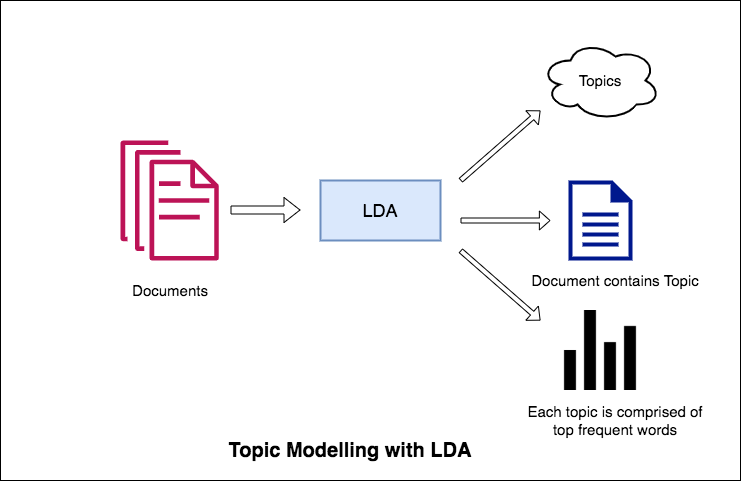

LDA’s approach to topic modeling is it considers each document as a collection of topics in a certain proportion. And each topic as a collection of keywords, again, in a certain proportion.

Once you provide the algorithm with the number of topics, all it does it to rearrange the topics distribution within the documents and keywords distribution within the topics to obtain a good composition of topic-keywords distribution.

### Day 68: Principal Component Analysis(PCA)

PCA is fundamentally a dimensionality reduction technique that transforms the columns of a dataset into a new set features. It does this by finding a new set of directions (like X and Y axes) that explain the maximum variability in the data. This new system coordinate axes is called Principal Components (PCs).

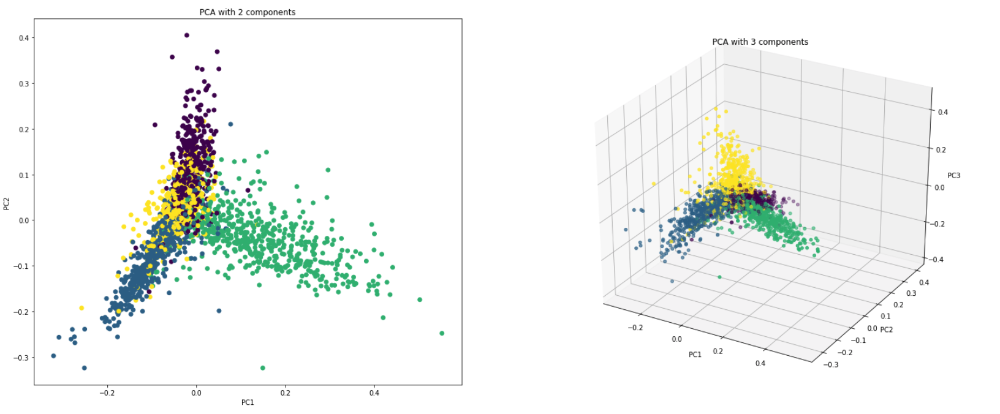

Practically PCA is used for two reasons:

- **`Dimensionality Reduction`**: The information distributed across a large number of columns is transformed into principal components (PC) such that the first few PCs can explain a sizeable chunk of the total information (variance). These PCs can be used as explanatory variables in Machine Learning models.

- **`Visualize Data`**: Visualising the separation of classes (or clusters) is hard for data with more than 3 dimensions (features). With the first two PCs itself, it’s usually possible to see a clear separation.

### Day 69: Naive Bayes Algorithm

A Naive Bayes classifier is a probabilistic machine learning model that’s used for classification task. The crux of the classifier is based on the Bayes theorem.

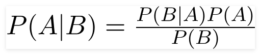

Using Bayes theorem, we can find the probability of A happening, given that B has occurred. Here, B is the evidence and A is the hypothesis. The assumption made here is that the predictors/features are independent. That is presence of one particular feature does not affect the other. Hence it is called naive.

**Types of Naive Bayes Classifier**:

`Multinomial Naive Bayes`:
This is mostly used when the variables are discrete (like words). The features/predictors used by the classifier are the frequency of the words present in the document.

`Gaussian Naive Bayes`:
When the predictors take up a continuous value and are not discrete, we assume that these values are sampled from a gaussian distribution.

`Bernoulli Naive Bayes`:
This is similar to the multinomial naive bayes but the predictors are boolean variables. The parameters that we use to predict the class variable take up only values yes or no, for example if a word occurs in the text or not.

Using 20newsgroup dataset, naive bayes algorithm is explored to do the classification.

### Day 74: Data Augmentation in NLP

In Computer Vision using image data augmentation is a standard practice. This is because trivial operations for images like rotating an image a few degrees or converting it into grayscale doesn’t change its semantics. Whereas in natural language processing (NLP) field, it is hard to augmenting text due to high complexity of language.

Data Augmentation using the following techniques is explored:

- Synonym-based Substitution
- Antonym-based Substitution
- Back Translation
- Text Surface Transformation
- Random Noise Injection
- Word Embedding based Substitution
- Contextual Word Embeddings (BERT family) based Substitution

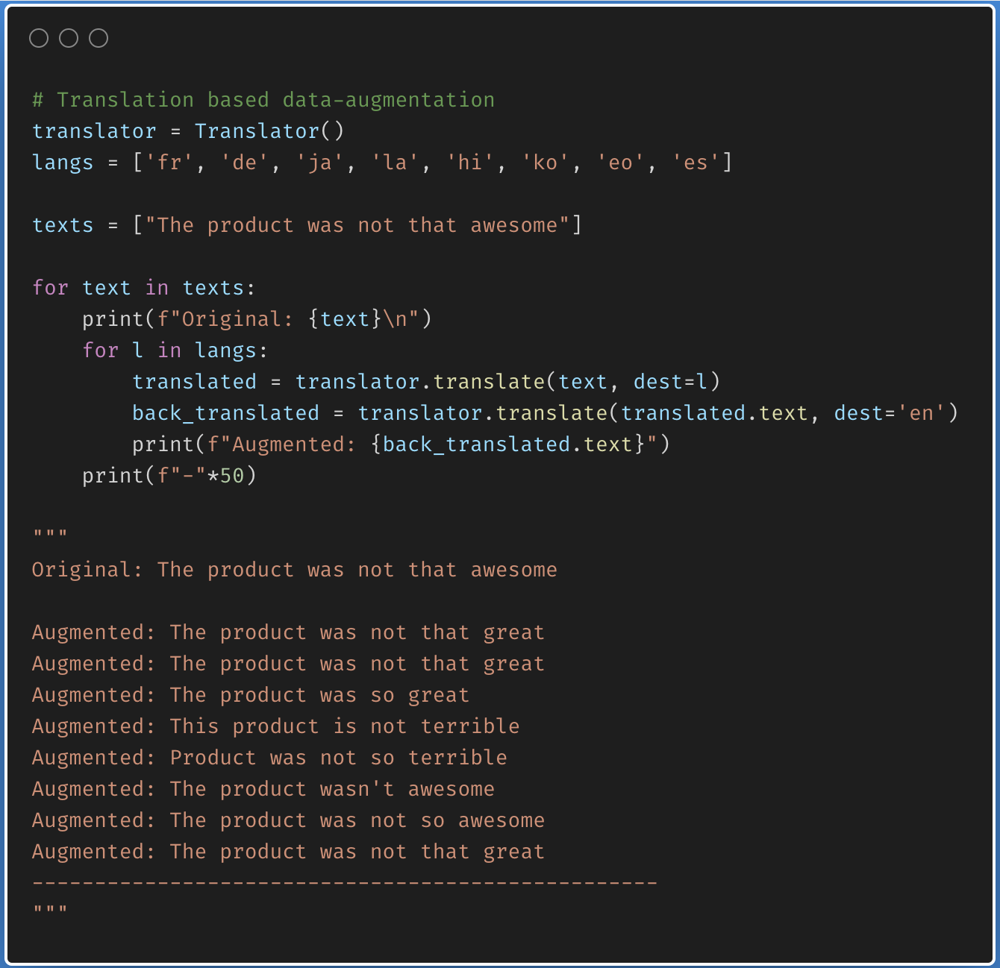

Checkout the code in `architectures` folder

<h1 align="center" style="font-size:60px">
    Applications of NLP
</h1>

There are many kinds of NLP problems like chatbots, sentiment classification, machine translation, document classification, named entity recognition, text summarization, natural language inference, information retrieval, image captioning, emotion recognition, recommendation systems, and many others. Here, I will try to work on some of the problems in NLP.

## Recommendation based Applications

### Day 5: Song Recommendation

By taking user’s listening queue as a sentence, with each word in that sentence being a song that the user has listened to, training the Word2vec model on those sentences essentially means that for each song the user has listened to in the past, we’re using the songs they have listened to before and after to teach our model that those songs somehow belong to the same context.

What’s interesting about those vectors is that similar songs will have weights that are closer together than songs that are unrelated.

Checkout the code in `applications/recommendations` folder

## Classification based Applications

### Day 7: Simple Sentiment Classification with RNN - IMDB

Sentiment analysis refers to the use of natural language processing, text analysis, computational linguistics, and biometrics to systematically identify, extract, quantify, and study affective states and subjective information.

As an example, IMDb dataset is used and simpleRNN is used for processing and identifying the sentiment.

### Day 8: Improved Sentiment Classification - IMDB

After trying the basic RNN which gives a test_accuracy less than 50%, following techniques have been experimented and a test_accuracy above 88% is achieved.

Techniques used:
- packed padded sequences
- pre-trained word embeddings
- different RNN architecture
- bidirectional RNN
- multi-layer RNN
- regularization
- a different optimizer

### Day 17: Sentiment Analysis with Attention - IMDB

Attention helps in focusing on the relevant input when predicting the sentiment of the input. Bahdanau attention was used with taking the outputs of LSTM and concatenating the final forward & backward hidden state. Without using the pre-trained word embeddings, test accuracy of `88%` is achieved.

### Day 25: Sentiment Analysis with BERT - IMDB

BERT obtains new state-of-the-art results on eleven natural language processing tasks. Transfer learning in NLP has triggered after the release of BERT model. Using BERT to do the sentiment analysis is explored.

### Day 21: Document Classification with Hierarchical Attention Network

A Hierarchical Attention Network (HAN) considers the hierarchical structure of documents (document - sentences - words) and includes an attention mechanism that is able to find the most important words and sentences in a document while taking the context into consideration.

### Day 22: Improved HAN with regularization techniques

The basic HAN model is overfitting rapidly. In order to overcome this, techniques like `Embedding Dropout`, `Locked Dropout` are explored. There is one more other technique called `Weight Dropout` which is not implemented (Let me know if there are any good resources to implement this). Pre-trained word embeddings `Glove` are also used instead of random initialization. Since the attention can be done on sentence level and word level, we can visualize which words are important in a sentence and which sentences are important in a document.

### Day 27: QQP Classification with Siamese Network

QQP stands for Quora Question Pairs. The objective of the task is for a given pair of questions; we need to find whether those questions are semantically similar to each other or not.

The algorithm needs to take the pair of questions as input and should output their similarity.
A Siamese network is used. A `Siamese neural network` (sometimes called a twin neural network) is an artificial neural network that uses the `same weights` while working in tandem on two different input vectors to compute comparable output vectors.

### Day 28: QQP Classification with BERT

After trying the siamese model, BERT was explored to do the Quora duplicate question pairs detection. BERT takes the question 1 and question 2 as input separated by `[SEP]` token and the classification was done using the final representation of `[CLS]` token.

### Day 31: POS Classification with BiLSTM

Part-of-Speech (PoS) tagging, is a task of labelling each word in a sentence with its appropriate part of speech. This code covers the basic workflow. We'll learn how to: load data, create train/test/validation splits, build a vocabulary, create data iterators, define a model and implement the train/evaluate/test loop and run time (inference) tagging.

The model used is a Multi Layer Bi-directional LSTM network

### Day 32: POS tagging with Transformer

After trying the RNN approach, POS tagging with Transformer based architecture is explored. Since the Transformer contains both Encoder and Decoder and for the sequence labeling task only `Encoder` will be sufficient. As the data is small having 6 layers of Encoder will overfit the data. So a 3-layer Transformer Encoder model was used.

### Day 33: POS tagging with BERT

After trying POS tagging with Transformer Encoder, POS Tagging with pre-trained BERT model is exploed. It achieved test accuracy of `91%`.

### Day 44: NLI with BiLSTM

The goal of natural language inference (NLI), a widely-studied natural language processing task, is to determine if one given statement (a premise) semantically entails another given statement (a hypothesis).

A basic model with Siamese BiLSTM network is implemeted

This can be treated as base-line setup. A test accuracy of `76.84%` was achieved.

### Day 45: NLI with Attention

In the previous notebook, the final hidden states of Premise and Hypothesis as the representations from LSTM. Now instead of taking the final hidden states, attention will be computed across all the input tokens and a final weighted vector is taken as the representation of Premise and Hypothesis. 

The test accuracy increased from `76.84%` to `79.51%`.

### Day 46: NLI with Transformer

Transformer Encoder was used to encode the Premise and Hypothesis. Once the sentence is passed through the Encoder, summation of all the tokens is considered as the final representation (others variants can be explored). The model accuracy is less compared to RNN variants.

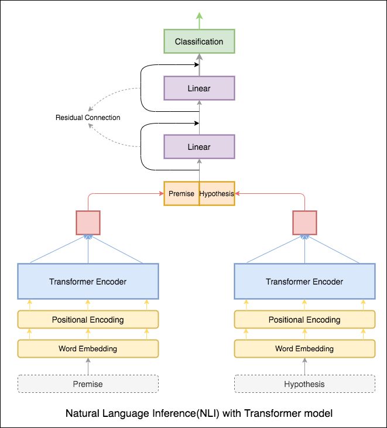

### Day 47: NLI with BERT

NLI with Bert base model was explored. BERT takes the Premise and Hypothesis as inputs separated by `[SEP]` token and the classification was done using the final representation of `[CLS]` token.

### Day 48: NLI with Distillation

**`Distillation`**: A technique you can use to compress a large model, called the `teacher`, into a smaller model, called the `student`. Following student, teacher models are used in order to perform distillation on NLI.

- Student Model: Logistic Regression
- Teacher Model: Bi-directional LSTM with Attention

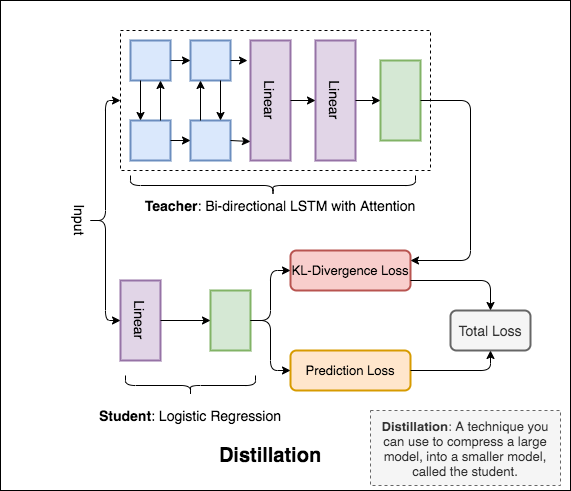

### Day 49: Toxic Comment Classification with GRU

Discussing things you care about can be difficult. The threat of abuse and harassment online means that many people stop expressing themselves and give up on seeking different opinions. Platforms struggle to effectively facilitate conversations, leading many communities to limit or completely shut down user comments.

You are provided with a large number of Wikipedia comments which have been labeled by human raters for toxic behavior. The types of toxicity are:

- toxic
- severe_toxic
- obscene
- threat
- insult
- identity_hate

The model used is a Bi-directional GRU network.

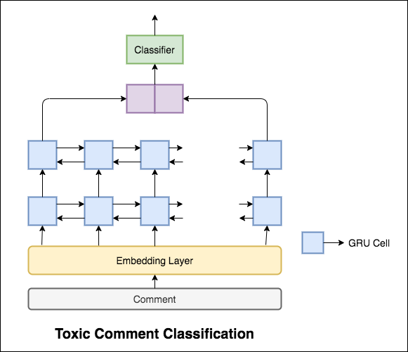

A test accuracy of `99.42%` was achieved.

### Day 50: Toxic Comment Classification with GRU

With bi-directional GRU model, test-accuracy of 99.42% was achieved. Since 90% of the data is not labeled into any of the toxicity, simply predicting all the data as non-toxic gives a 90% accurate model. So accuracy is not a reliable metric. A different metric ROC AUC was implemented.

### Day 51: Improved Toxic Comment Classification

With `Categorical Cross Entropy` as the loss, roc_auc score of `0.5` is achieved. By changing the loss to `Binary Cross Entropy` and also modifying the model a bit by adding pooling layers (max, mean), the roc_auc score improved to `0.9873`.

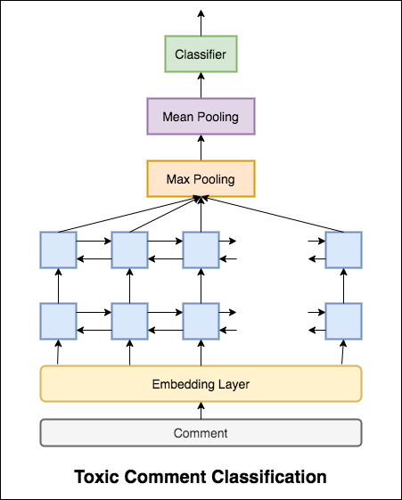

### Day 52: Toxic Comment Classification using Streamlit

Converted the Toxic Comment Classification into an app using streamlit. The pre-trained model is available now.

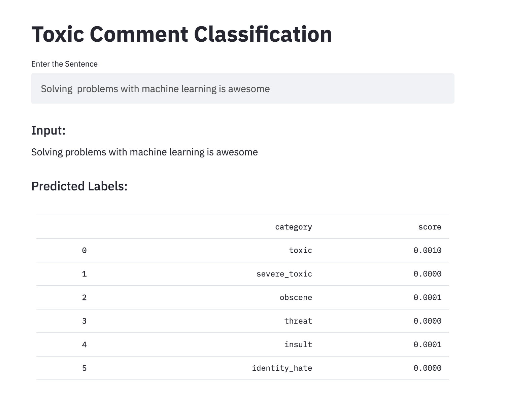

### Day 53: Grammatically Correct Sentence Classification with BERT

Can artificial neural networks have the ability to judge the grammatical acceptability of a sentence? In order to explore this task, the Corpus of Linguistic Acceptability (CoLA) dataset is used. CoLA is a set of sentences labeled as grammatically correct or incorrect. 

BERT obtains new state-of-the-art results on eleven natural language processing tasks. Transfer learning in NLP has triggered after the release of BERT model. In this notebook, we will explore how to use BERT for classifying whether a sentence is grammatically correct or not using CoLA dataset.

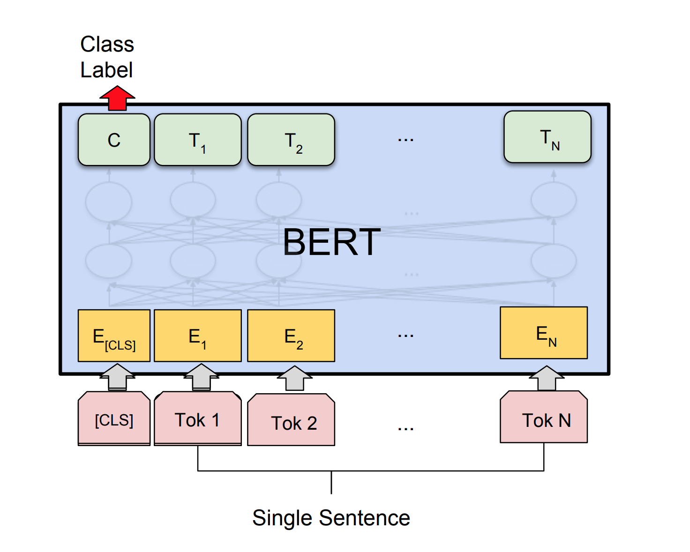

An accuracy of `85%` and Matthews Correlation Coefficient (MCC) of `64.1` were achieved.

### Day 54: CoLA with DistilBERT

**`Distillation`**: A technique you can use to compress a large model, called the `teacher`, into a smaller model, called the `student`. Following student, teacher models are used in order to perform distillation on CoLA.

- Student Model: Distilbert base uncased
- Teacher Model: Bert base uncased

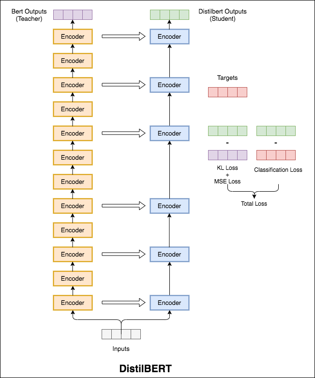

Following experiments have been tried:
- Training using Bert Model (Teacher). Acc: `84.06`, MCC: `61.5`
- Training using Distilbert Model (without teacher forcing). Acc: `82.54`, MCC: `57`
- Training using Distilbert Model (with teacher forcing). Acc: `82.92`, MCC: `57.9`

### Day 79: NER tagging with BiLSTM

Named-Entity-Recognition (NER) tagging, is a task of labelling each word in a sentence with its appropriate entity.

This code covers the basic workflow. We'll see how to: load data, create train/test/validation splits, build a vocabulary, create data iterators, define a model and implement the train/evaluate/test loop and train, test the model.

The model used is Bi-directional LSTM network

### Day 80: NER tagging with BiLSTM-CRF

In the case of Sequence tagging (NER) the tag of a current word might depend on previous word's tag. (ex: New York).

Without a CRF, we would have simply used a single linear layer to transform the output of the Bidirectional LSTM into scores for each tag. These are known as `emission scores`, which are a representation of the likelihood of the word being a certain tag.

A CRF calculates not only the emission scores but also the `transition scores`, which are the likelihood of a word being a certain tag considering the previous word was a certain tag. Therefore the transition scores measure how likely it is to transition from one tag to another.

### Day 81: NER Decoding using Viterbi Algorithm

For decoding, `Viterbi` algorithm is used.

Since we're using CRFs, we're not so much predicting the right label at each word as we are predicting the right label sequence for a word sequence. Viterbi Decoding is a way to do exactly this – find the most optimal tag sequence from the scores computed by a Conditional Random Field.

### Day 82: NER tagging with Char-BiLSTM-CRF

Using sub-word information in our tagging task because it can be a powerful indicator of the tags, whether they're parts of speech or entities. For example, it may learn that adjectives commonly end with "-y" or "-ul", or that places often end with "-land" or "-burg".

Therefore, our sequence tagging model uses both

- `word-level` information in the form of word embeddings.
- `character-level` information up to and including each word in both directions.

Checkout the code in `applications/classification` folder

## Generation based Applications

### Day 10: Name Generation with LSTM

A character-level LSTM language model is used. That is, we’ll give the LSTM a huge chunk of names and ask it to model the probability distribution of the next character in the sequence given a sequence of previous characters. This will then allow us to generate new name one character at a time

Checkout the code in `applications/generation` folder

### Day 11: Basic Machine Translation: German to English

The most common sequence-to-sequence (seq2seq) models are encoder-decoder models, which commonly use a recurrent neural network (RNN) to encode the source (input) sentence into a single vector. In this notebook, we'll refer to this single vector as a context vector. We can think of the context vector as being an abstract representation of the entire input sentence. This vector is then decoded by a second RNN which learns to output the target (output) sentence by generating it one word at a time.

Checkout the code in `applications/generation` folder

### Day 12: Improved Machine Translation: German to English

After trying the basic machine translation which has text perplexity `36.68`, following techniques have been experimented and a test perplexity `7.041`.

- GRU is used instead of LSTM
- Single layer
- Context vector is sent to decoder rnn along with decoder input embedding
- Context vector is sent to classifier along with the decoder hidden state

Checkout the code in `applications/generation` folder

### Day 15: Machine Translation with Bahdanau Attention: German to English

The attention mechanism was born to help memorize long source sentences in neural machine translation (NMT). Rather than building a single context vector out of the encoder's last hidden state, attention is used to focus more on the relevant parts of the input while decoding a sentence. The context vector will be created by taking encoder outputs and the `previous hidden state` of the decoder rnn.

### Day 16: Masking, Packing padded inputs, Attention Visualization, BLEU on MT: German to English

Enhancements like masking (ignoring the attention over padded input), packing padded sequences (for better computation), attention visualization and BLEU metric on test data are implemented.

### Day 19: Machine Translation with Transformer: German to English

The Transformer, a model architecture eschewing recurrence and instead relying entirely on an attention mechanism to draw global dependencies between input and output is used to do Machine translation from German to English

### Day 20: Self Attention Visualization

Run time translation (Inference) and attention visualization are added for the transformer based machine translation model.

### Day 34: Basic Utterance Generation

Utterance generation is an important problem in NLP, especially in question answering, information retrieval, information extraction, conversation systems, to name a few. It could also be used to create synthentic training data for many NLP problems.

The most common used model for this kind of application is sequence-to-sequence network. A basic 2 layer LSTM was used.

### Day 35: Utterance Generation with Attention

The attention mechanism will help in memorizing long sentences. Rather than building a single context vector out of the encoder's last hidden state, attention is used to focus more on the relevant parts of the input while decoding a sentence. The context vector will be created by taking encoder outputs and the `hidden state` of the decoder rnn.

After trying the basic LSTM apporach, Utterance generation with attention mechanism was implemented. Inference (run time generation) was also implemented.

### Day 36: Visualization of Attention

While generating the a word in the utterance, decoder will attend over encoder inputs to find the most relevant word. This process can be visualized.

### Day 37: Utterance Generation with Beam Search

One of the ways to mitigate the repetition in the generation of utterances is to use Beam Search. By choosing the top-scored word at each step (greedy) may lead to a sub-optimal solution but by choosing a lower scored word that may reach an optimal solution.

Instead of greedily choosing the most likely next step as the sequence is constructed, the beam search expands all possible next steps and keeps the k most likely, where k is a user-specified parameter and controls the number of beams or parallel searches through the sequence of probabilities.

### Day 38: Utterance Generation with Coverage

Repetition is a common problem for sequenceto-sequence models, and is especially pronounced when generating a multi-sentence text. In coverage model, we maintain a
coverage vector `c^t`, which is the sum of attention distributions over all previous decoder timesteps

This ensures that the attention mechanism’s current decision (choosing where to attend next) is informed by a reminder of its previous decisions (summarized in c^t). This should make it easier for the attention mechanism to avoid repeatedly attending to the same locations, and thus avoid generating repetitive text.

### Day 39: Utterance Generation with Transformer

The Transformer, a model architecture eschewing recurrence and instead relying entirely on an attention mechanism to draw global dependencies between input and output is used to do generate utterance from a given sentence. The training time was also lot faster `4x` times compared to RNN based architecture.

### Day 40: Beam Search in Utterance Generation with Transformer

Added beam search to utterance generation with transformers. With beam search, the generated utterances are more diverse and can be more than 1 (which is the case of the greedy approach). This implemented was better than naive one implemented previously.

### Day 41: Utterance Generation with BPE Tokenization

Utterance generation using BPE tokenization instead of Spacy is implemented.

Today, subword tokenization schemes inspired by BPE have become the norm in most advanced models including the very popular family of contextual language models like BERT, GPT-2,RoBERTa, etc.

BPE brings the perfect balance between character and word-level hybrid representations which makes it capable of managing large corpora. This behavior also enables the encoding of any rare words in the vocabulary with appropriate subword tokens without introducing any “unknown” tokens.

### Day 42: Utterance Generation using Streamlit

Converted the Utterance Generation into an app using streamlit. The pre-trained model trained on the Quora dataset is available now.

### Day 43: General Utterance Generation

Till now the Utterance Generation is trained using the `Quora Question Pairs` dataset, which contains sentences in the form of questions. When given a normal sentence (which is not in a question format) the generated utterances are very poor. This is due the `bias` induced by the dataset. Since the model is only trained on question type sentences, it fails to generate utterances in case of normal sentences. In order to generate utterances for a normal sentence, `COCO` dataset is used to train the model.

### Day 55-56 Basic Image Captioning

Image Captioning is the process of generating a textual description of an image. It uses both Natural Language Processing and Computer Vision techniques to generate the captions.

The encoder-decoder framework is widely used for this task. The image encoder is a convolutional neural network (CNN). The decoder is a recurrent neural network(RNN) which takes in the encoded image and generates the caption.

In this notebook, the resnet-152 model pretrained on the ILSVRC-2012-CLS image classification dataset is used as the encoder. The decoder is a long short-term memory (LSTM) network.

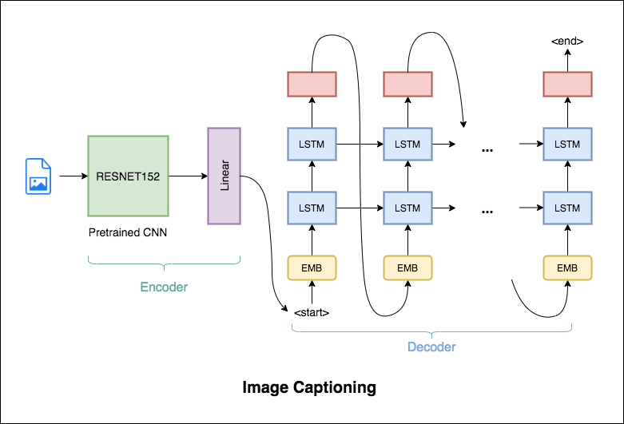

### Day 57: Image Captioning with Attention

In this notebook, the resnet-101 model pretrained on the ILSVRC-2012-CLS image classification dataset is used as the encoder. The decoder is a long short-term memory (LSTM) network. Attention is implemented. Instead of the simple average, we use the weighted average across all pixels, with the weights of the important pixels being greater. This weighted representation of the image can be concatenated with the previously generated word at each step to generate the next word of the caption.

### Day 58-59: Image Captioning with Beam Search

Instead of greedily choosing the most likely next step as the caption is constructed, the beam search expands all possible next steps and keeps the k most likely, where k is a user-specified parameter and controls the number of beams or parallel searches through the sequence of probabilities.

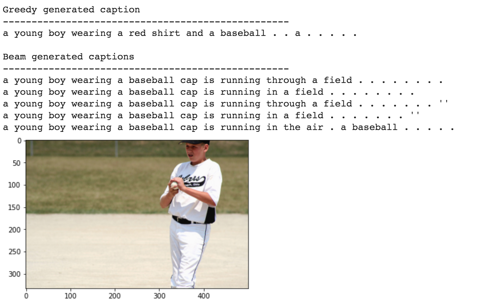

### Day 60: Image Captioning with BPE Tokenization

Today, subword tokenization schemes inspired by BPE have become the norm in most advanced models including the very popular family of contextual language models like BERT, GPT-2,RoBERTa, etc.

BPE brings the perfect balance between character and word-level hybrid representations which makes it capable of managing large corpora. This behavior also enables the encoding of any rare words in the vocabulary with appropriate subword tokens without introducing any “unknown” tokens.

BPE was used in order to tokenize the captions instead of using nltk.

### Day 61: News Summarization with T5

Automatic text summarization is the task of producing a concise and fluent summary while preserving key information content and overall meaning. Have you come across the mobile app `inshorts`? It’s an innovative news app that converts news articles into a 60-word summary.  And that is exactly what we are going to do in this notebook. The model used for this task is `T5`.

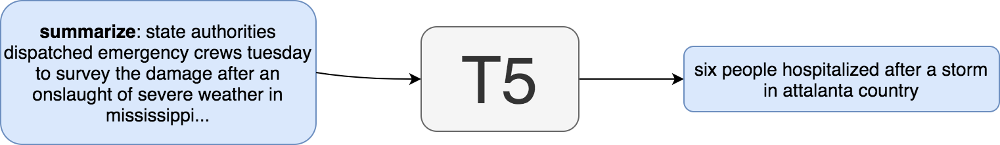

### Day 62: Email Subject Generation with T5.

Given the overwhelming number of emails, an effective subject line becomes essential to better inform the recipient of the email's content.

Email subject generation using T5 model was explored. AESLC dataset was used for this purpose.

### Day 70: Basic Image to Latex

An application of image captioning is to convert the the equation present in the image to latex format. Basic Sequence-to-Sequence models is used. CNN is used as encoder and RNN as decoder. Im2latex dataset is used. It contains 100K samples comprising of training, validation and test splits. 

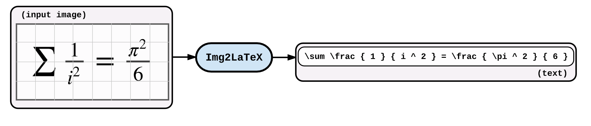

Generated formulas are not great. Following notebooks will explore techniques to improve it.

### Day 71: Image to Latex with Attention

Latex code generation using the attention mechanism is implemented. Instead of the simple average, we use the weighted average across all pixels, with the weights of the important pixels being greater. This weighted representation of the image can be concatenated with the previously generated word at each step to generate the next word of the formula.

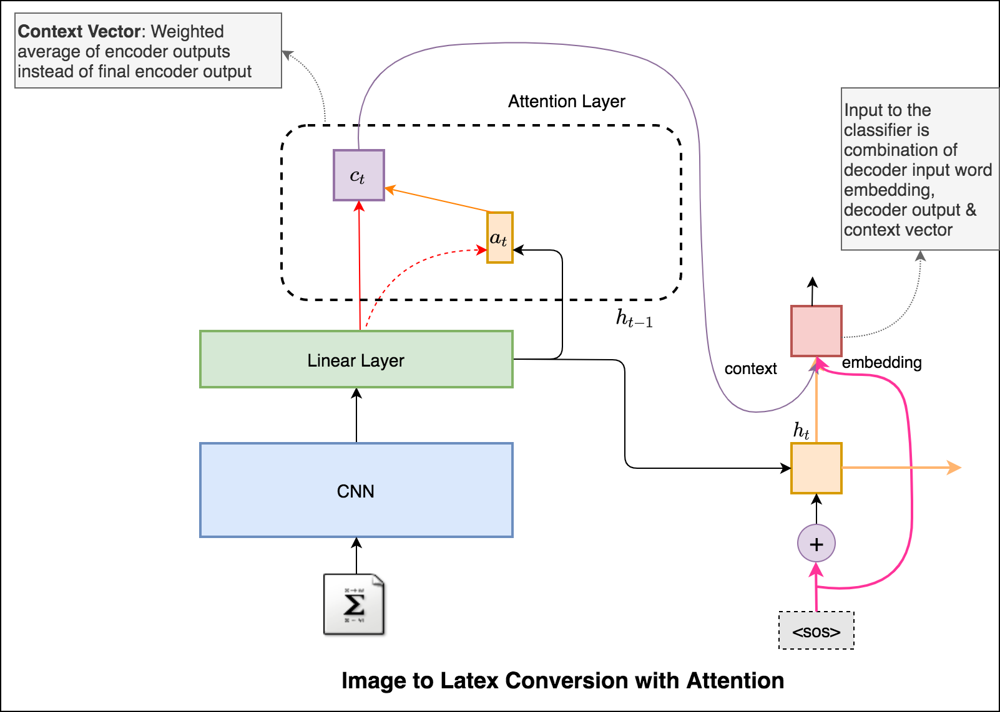

### Day 72: Image to Latex with Beam Search

Added beam search in the decoding process. Also added Positional encoding to the input image and learning rate scheduler.

### Day 73: Image to LaTex Conversion using Streamlit

Converted the Latex formula generation into an app using streamlit.

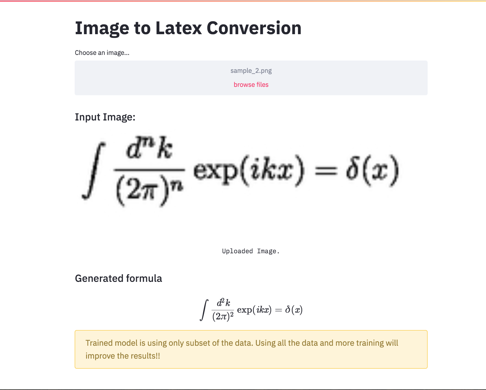

Checkout the code in `applications/generation` folder

## Ranking Based Applications

### Day 30: Covid-19 Browser

There was a kaggle problem on [covid-19 research challenge](https://www.kaggle.com/allen-institute-for-ai/CORD-19-research-challenge) which has over `1,00,000 +` documents. This freely available dataset is provided to the global research community to apply recent advances in natural language processing and other AI techniques to generate new insights in support of the ongoing fight against this infectious disease. There is a growing urgency for these approaches because of the rapid acceleration in new coronavirus literature, making it difficult for the medical research community to keep up.

The procedure I have taken is to convert the `abstracts` into a embedding representation using [`sentence-transformers`](https://github.com/UKPLab/sentence-transformers/). When a query is asked, it will converted into an embedding and then ranked across the abstracts using `cosine` similarity.

## Clustering based Applications

### Day 64: Topic Identification in News using LDA

LDA’s approach to topic modeling is it considers each document as a collection of topics in a certain proportion. And each topic as a collection of keywords, again, in a certain proportion.

Once you provide the algorithm with the number of topics, all it does it to rearrange the topics distribution within the documents and keywords distribution within the topics to obtain a good composition of topic-keywords distribution.

20 Newsgroup dataset was used and only the articles are provided to identify the topics. Topic Modelling algorithms will provide for each topic what are the important words. It is upto us to infer the topic name.

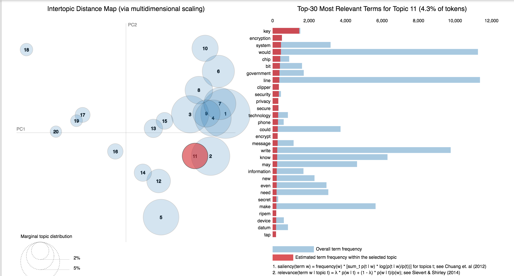

### Day 65: Improved Topic Identification in News using LDA

Choosing the number of topics is a difficult job in Topic Modelling. In order to choose the optimal number of topics, grid search is performed on various hypermeters. In order to choose the best model the model having the best perplexity score is choosed.

A good topic model will have non-overlapping, fairly big sized blobs for each topic. 

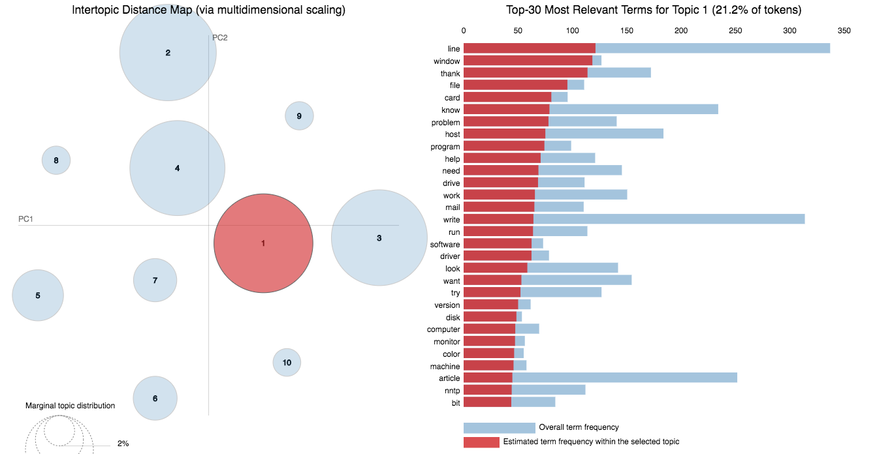

- LDA using scikit-learn is implemented.
- Inference (predicting the topic of a given sentence) is also implemented.

### Day 67: Topic Identification in News using LSA

We would clearly expect that the words that appear most frequently in one topic would appear less frequently in the other - otherwise that word wouldn't make a good choice to separate out the two topics. Therefore, we expect the topics to be `orthogonal`.

Latent Semantic Analysis (LSA) uses SVD. You will sometimes hear topic modelling referred to as LSA.

The SVD algorithm factorizes a matrix into one matrix with `orthogonal columns` and one with `orthogonal rows` (along with a diagonal matrix, which contains the relative importance of each factor).

Notes:
- SVD is a determined dimension reduction algorithm
- LDA is a probability-based generative model

### Day 66: Covid article finding using LDA

Finding the relevant article from a covid-19 research article [corpus of 50K+ documents](https://www.kaggle.com/allen-institute-for-ai/CORD-19-research-challenge) using LDA is explored.

The documents are first clustered into different topics using LDA. For a given query, dominant topic will be found using the trained LDA. Once the topic is found, most relevant articles will be fetched using the `jensenshannon` distance.

Only abstracts are used for the LDA model training. LDA model was trained using 35 topics.

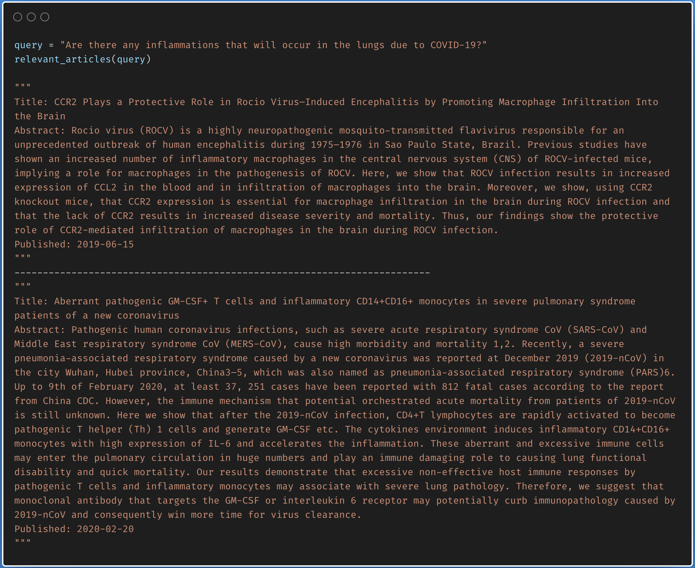

## Question Answering based Applications in NLP

### Day 75: Basic Question Answering with Dynamic Memory Networks

Dynamic Memory Network (DMN) is a neural network architecture which processes input sequences and questions, forms episodic memories, and generates relevant answers.

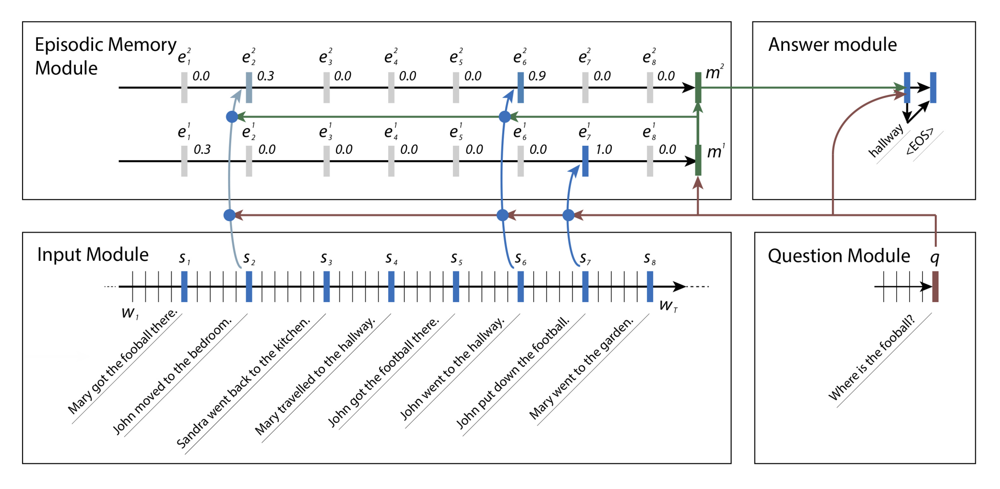

Dataset used is bAbI which has 20 tasks with an amalgamation of inputs, queries and answers. See the following figure for sample.

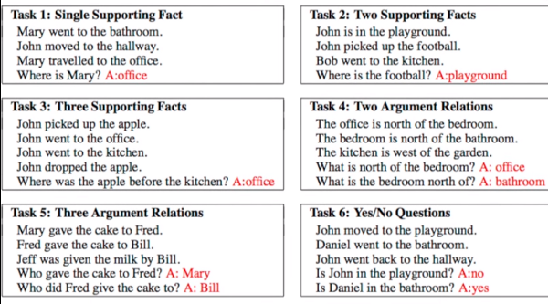

### Day 76: Question Answering using DMN Plus

The main difference between DMN+ and DMN is the improved InputModule for calculating the facts from input sentences keeping in mind the exchange of information between input sentences using a Bidirectional GRU and a improved version of MemoryModule using Attention based GRU model.

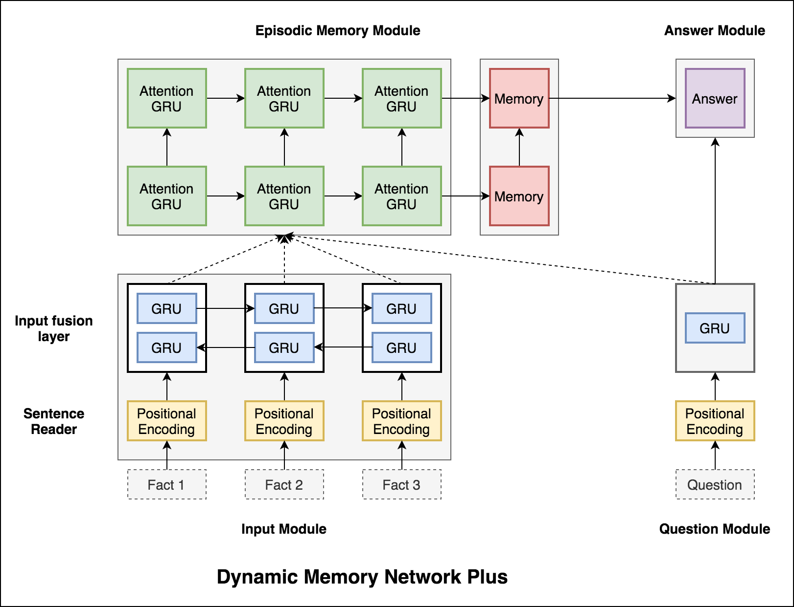

### Day 77: Basic Visual Question Answering

Visual Question Answering (VQA) is the task of given an image and a natural
language question about the image, the task is to provide an accurate natural language answer.

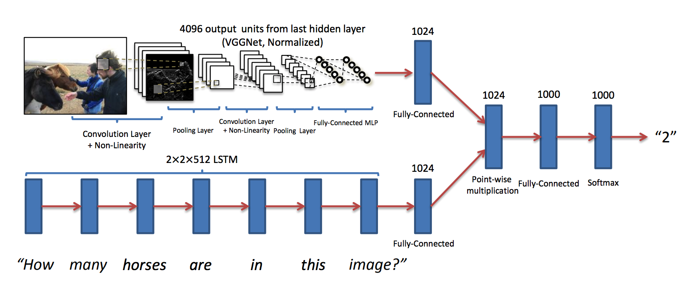

The model uses a two layer LSTM to encode the questions and the last hidden layer of VGGNet to encode the images. The image features are then l_2 normalized. Both the question and image features are transformed to a common space and fused via element-wise multiplication, which is then passed through a fully connected layer followed by a softmax layer to obtain a distribution over answers.

### Day78: Visual Question Answering with DMN Plus

To apply the DMN to visual question answering, input module is modified for images. The module splits an image into small local regions and considers each region equivalent to a sentence in the input module for text.

The input module for VQA is composed of three parts, illustrated in below fig: 
- local region feature extraction
- visual feature embedding
- input fusion layer

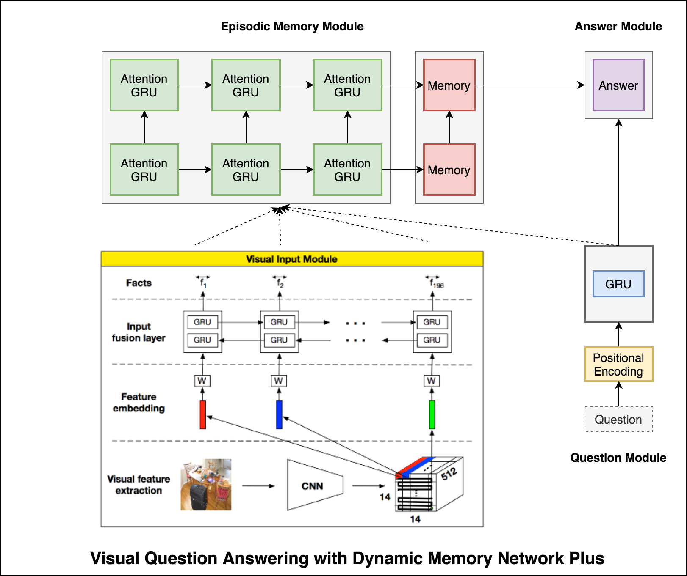
