 > There is nothing magic about magic. The magician merely understands something simple which doesn’t appear to be simple or natural to the untrained audience. Once you learn how to hold a card while making your hand look empty, you only need practice before you, too, can “do magic.” – Jeffrey Friedl in the book Mastering Regular Expressions

**Note: Please raise an issue for any suggestions, corrections, and feedback.**

<h1 align="center" style="font-size:60px">
    Building Blocks of NLP
</h1>

## Tokenization

### Day 1

The process of converting textual data to tokens, is one of the most important step in NLP. Tokenization using the following methods has been explored:

- [Spacy](https://spacy.io/usage/linguistic-features#tokenization)
- [Byte Pair Encoding (Sentencepiece)](https://github.com/google/sentencepiece)
- [Unigram Encoding (Sentencepiece)](https://github.com/google/sentencepiece)
- [Torchtext](https://pytorch.org/text/data_utils.html)
- [Tokenizers](https://github.com/huggingface/tokenizers)

Checkout the code in `tokenization` folder

## Word Embeddings

A word embedding is a learned representation for text where words that have the same meaning have a similar representation. It is this approach to representing words and documents that may be considered one of the key breakthroughs of deep learning on challenging natural language processing problems.

### Day 2: Word2Vec

Word2Vec is one of the most popular pretrained word embeddings developed by Google. Depending on the way the embeddings are learned, Word2Vec is classified into two approaches:

- Continuous Bag-of-Words (CBOW)
- Skip-gram model

### Day 3: GloVe

GloVe is another commonly used method of obtaining pre-trained embeddings. GloVe aims to achieve two goals:

- Create word vectors that capture meaning in vector space
- Takes advantage of global count statistics instead of only local information

### Day 4: ELMo

ELMo is a deep contextualized word representation that models:

- complex characteristics of word use (e.g., syntax and semantics)
- how these uses vary across linguistic contexts (i.e., to model polysemy).

These word vectors are learned functions of the internal states of a deep bidirectional language model (biLM), which is pre-trained on a large text corpus.

### Day 29: Sentence Embeddings

A new architecture called SBERT was explored. The siamese network architecture enables that fixed-sized vectors for input sentences can be derived. Using a similarity measure like cosinesimilarity or Manhatten / Euclidean distance, semantically similar sentences can be found.

Checkout the code in `embeddings` folder

## Architectures & Techniques

There are several ways the input can be processed after tokenization. One can use different machine learning algorithms, statistical methods (or) deep learning architectures. Here I will try to cover some of the most prominent architectures & techniques used in NLP like RNN, Attention mechanism, ULMFit, Transformer, GPT-2, BERT, and others.

### Day 6: RNN

Recurrent networks - RNN, LSTM, GRU have proven to be one of the most important unit in NLP applications because of their architecture. There are many problems where the sequence nature needs to be remembered like in order to predict an emotion in the scene, previous scenes needs to be remembered.

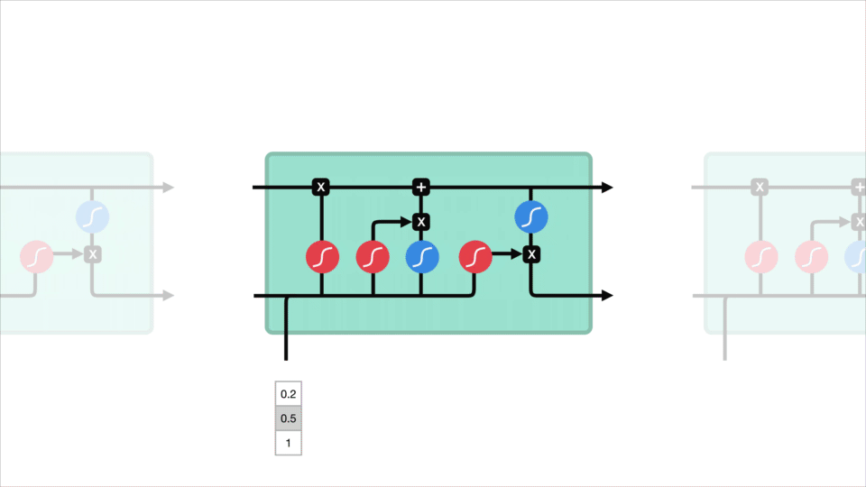

### Day 9: pack_padded_sequences

When training RNN (LSTM or GRU or vanilla-RNN), it is difficult to batch the variable-length sequences. Ideally we will pad all the sequences to a fixed length and end up doing un-necessary computations. How can we overcome this? PyTorch provides the `pack_padded_sequences` functionality.

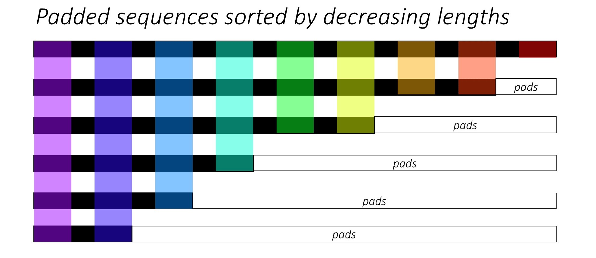

### Day 13: Luong Attention

The attention mechanism was born to help memorize long source sentences in neural machine translation (NMT). Rather than building a single context vector out of the encoder's last hidden state, attention is used to focus more on the relevant parts of the input while decoding a sentence. The context vector will be created by taking encoder outputs and the `current output` of the decoder rnn.

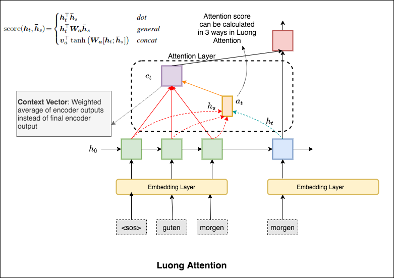

The attention score can be calculated in three ways. `dot`, `general` and `concat`.

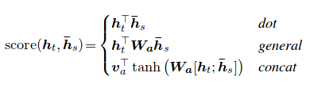

### Day 14: Bahdanau Attention

The major difference between Bahdanau & Luong attention is the way the context vector is created. The context vector will be created by taking encoder outputs and the `previous hidden state` of the decoder rnn. Where is in Luong attention the context vector will be created by taking encoder outputs and the `current hidden state` of the decoder rnn.

Once the context is calculated it is combined with decoder input embedding and fed as input to decoder rnn.

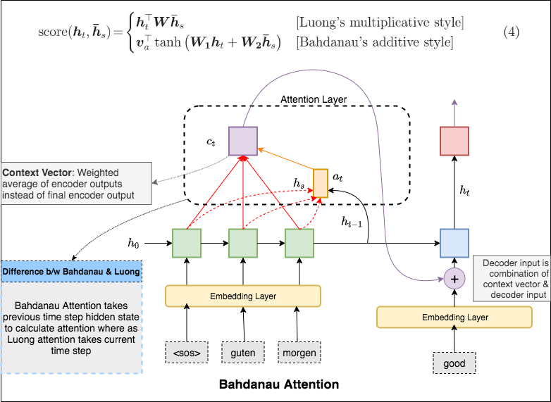

The Bahdanau attention is also called as `additive` attention.

### Day 18: Transformer

Attention mechanisms have become an integral part of compelling sequence modeling and transduction models in various tasks, allowing modeling of dependencies without regard to their distance in the input or output sequences. Such attention mechanisms are used in conjunction with a recurrent network.

The Transformer, a model architecture eschewing recurrence and instead relying entirely on an attention mechanism to draw global dependencies between input and output.

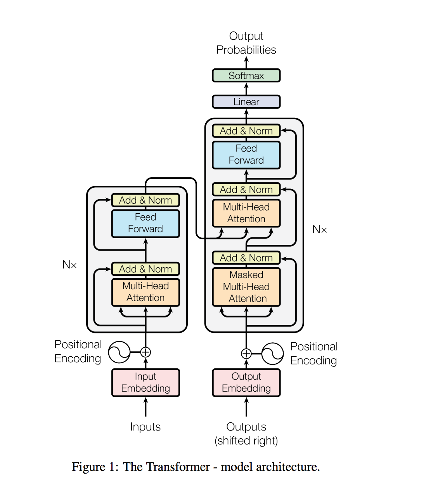

### Day 23: GPT-2

The GPT-2 paper states that: 

> Natural language processing tasks, such as question answering, machine translation, reading comprehension, and summarization, are typically approached with supervised learning on taskspecific datasets. We demonstrate that language models begin to learn these tasks without any explicit supervision when trained on a new dataset of millions of webpages called WebText. Our largest model, GPT-2, is a 1.5B parameter Transformer that achieves state of the art results on 7 out of 8 tested language modeling datasets in a zero-shot setting but still underfits WebText. Samples from the model reflect these improvements and contain coherent paragraphs of text. These findings suggest a promising path towards building language processing systems which learn to perform tasks from their naturally occurring demonstrations.

The GPT-2 utilizes a 12-layer Decoder Only Transformer architecture.

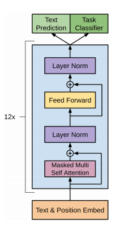

### Day 24: BERT

Language modeling is an effective task for using unlabeled data to pretrain neural networks in NLP. Traditional language models take the previous n tokens and predict the next one. In contrast, BERT trains a language model that takes both the previous and next tokens into account when predicting. BERT is also trained on a next sentence prediction task to better handle tasks that require reasoning about the relationship between two sentences (e.g. similar questions or not)

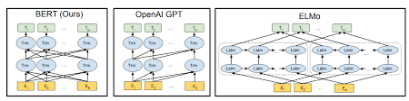

BERT uses the Transformer architecture for encoding sentences.

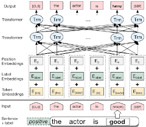

### Day 26: Pointer Network

Pointer networks are sequence-to-sequence models where the output is discrete tokens corresponding to positions in an input sequence. The main differences between pointer networks and standard seq2seq models are:

- The output of pointer networks is discrete and correspond to positions in the input sequence

- The number of target classes in each step of the output depends on the length of the input, which is variable.

It differs from the previous attention attempts in that, instead of using attention to blend hidden units of an encoder to a context vector at each decoder step, it uses attention as a pointer to select a member of the input sequence as the output.

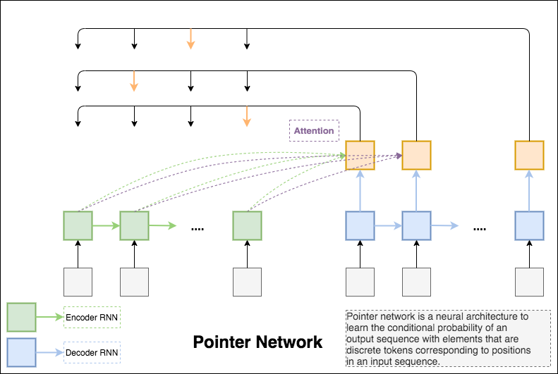

Checkout the code in `architectures` folder

<h1 align="center" style="font-size:60px">
    Applications of NLP
</h1>

There are many kinds of NLP problems like chatbots, sentiment classification, machine translation, document classification, named entity recognition, text summarization, natural language inference, information retrieval, image captioning, emotion recognition, recommendation systems, and many others. Here, I will try to work on some of the problems in NLP.

## Recommendation based Applications

### Day 5: Song Recommendation

By taking user’s listening queue as a sentence, with each word in that sentence being a song that the user has listened to, training the Word2vec model on those sentences essentially means that for each song the user has listened to in the past, we’re using the songs they have listened to before and after to teach our model that those songs somehow belong to the same context.

What’s interesting about those vectors is that similar songs will have weights that are closer together than songs that are unrelated.

Checkout the code in `applications/recommendations` folder

## Classification based Applications

### Day 7: Simple Sentiment Classification with RNN - IMDB

Sentiment analysis refers to the use of natural language processing, text analysis, computational linguistics, and biometrics to systematically identify, extract, quantify, and study affective states and subjective information.

As an example, IMDb dataset is used and simpleRNN is used for processing and identifying the sentiment.

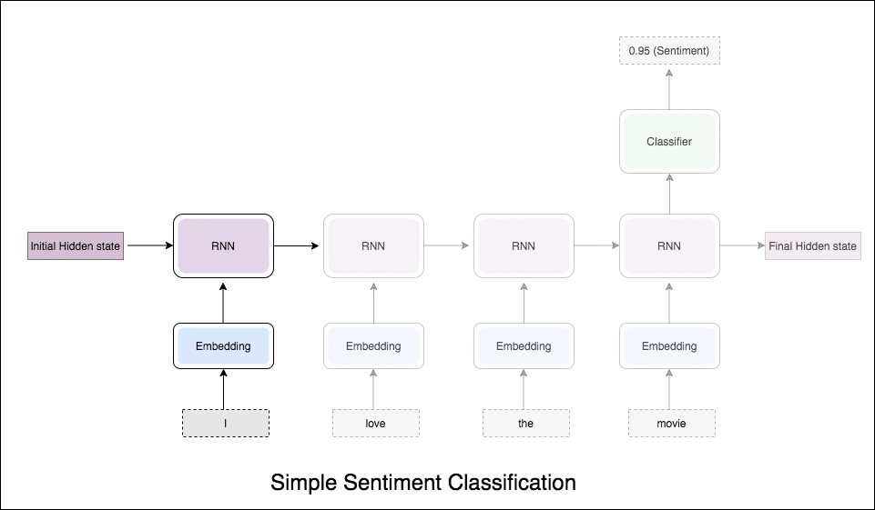

### Day 8: Improved Sentiment Classification - IMDB

After trying the basic RNN which gives a test_accuracy less than 50%, following techniques have been experimented and a test_accuracy above 88% is achieved.

Techniques used:
- packed padded sequences
- pre-trained word embeddings
- different RNN architecture
- bidirectional RNN
- multi-layer RNN
- regularization
- a different optimizer

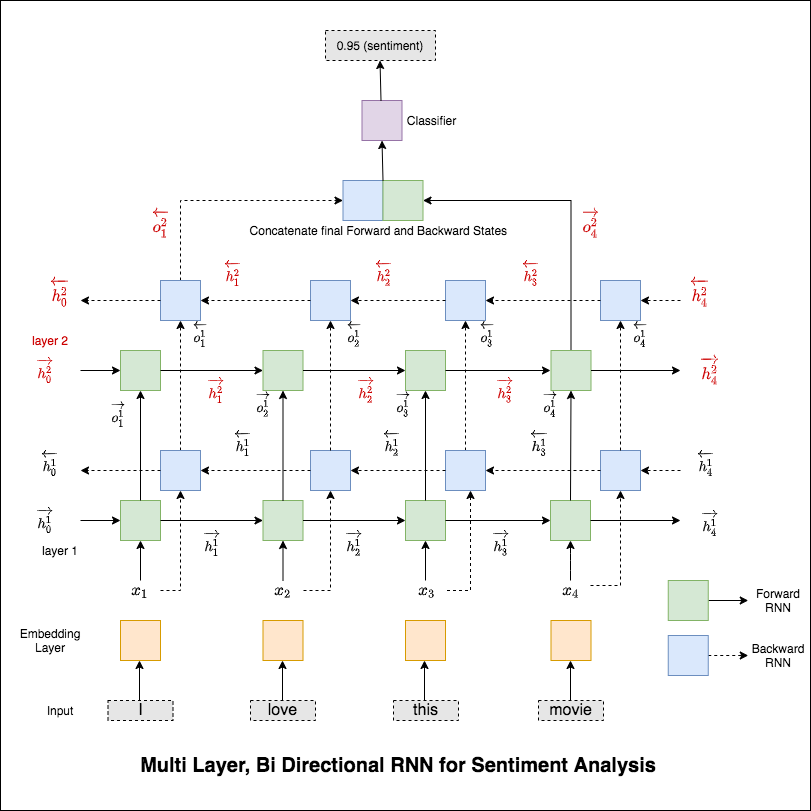

### Day 17: Sentiment Analysis with Attention - IMDB

Attention helps in focusing on the relevant input when predicting the sentiment of the input. Bahdanau attention was used with taking the outputs of LSTM and concatenating the final forward & backward hidden state. Without using the pre-trained word embeddings, test accuracy of `88%` is achieved.

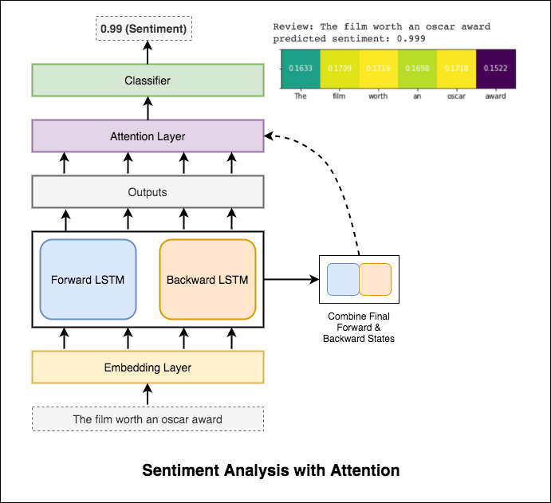

### Day 25: Sentiment Analysis with BERT - IMDB

BERT obtains new state-of-the-art results on eleven natural language processing tasks. Transfer learning in NLP has triggered after the release of BERT model. Using BERT to do the sentiment analysis is explored.

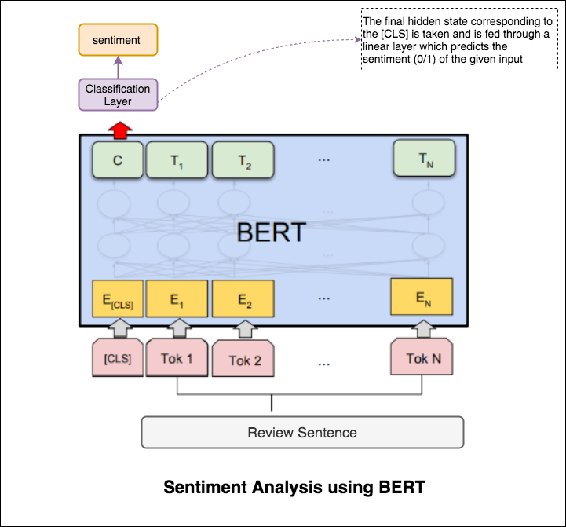

### Day 21: Document Classification with Hierarchical Attention Network

A Hierarchical Attention Network (HAN) considers the hierarchical structure of documents (document - sentences - words) and includes an attention mechanism that is able to find the most important words and sentences in a document while taking the context into consideration.

### Day 22: Improved HAN with regularization techniques

The basic HAN model is overfitting rapidly. In order to overcome this, techniques like `Embedding Dropout`, `Locked Dropout` are explored. There is one more other technique called `Weight Dropout` which is not implemented (Let me know if there are any good resources to implement this). Pre-trained word embeddings `Glove` are also used instead of random initialization. Since the attention can be done on sentence level and word level, we can visualize which words are important in a sentence and which sentences are important in a document.

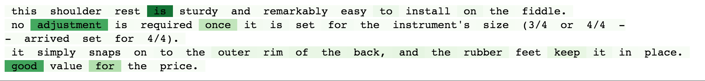

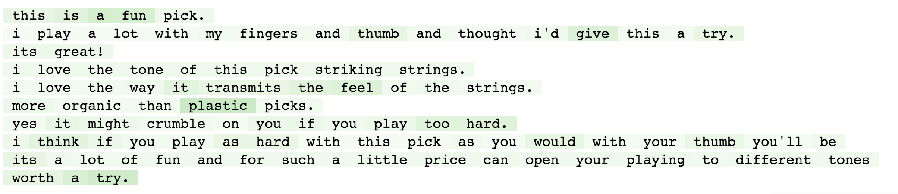

### Day 27: QQP Classification with Siamese Network

QQP stands for Quora Question Pairs. The objective of the task is for a given pair of questions; we need to find whether those questions are semantically similar to each other or not.

The algorithm needs to take the pair of questions as input and should output their similarity.
A Siamese network is used. A `Siamese neural network` (sometimes called a twin neural network) is an artificial neural network that uses the `same weights` while working in tandem on two different input vectors to compute comparable output vectors.

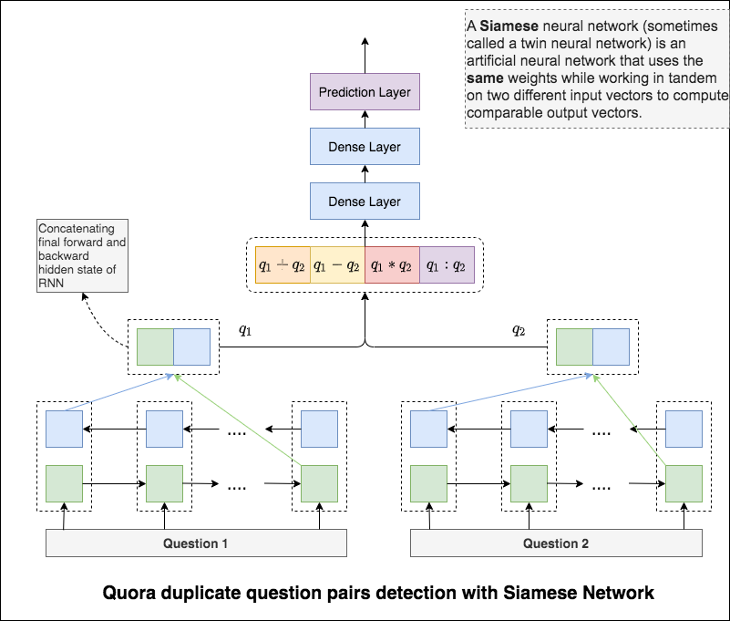

### Day 28: QQP Classification with BERT

After trying the siamese model, BERT was explored to do the Quora duplicate question pairs detection. BERT takes the question 1 and question 2 as input separated by `[SEP]` token and the classification was done using the final representation of `[CLS]` token.

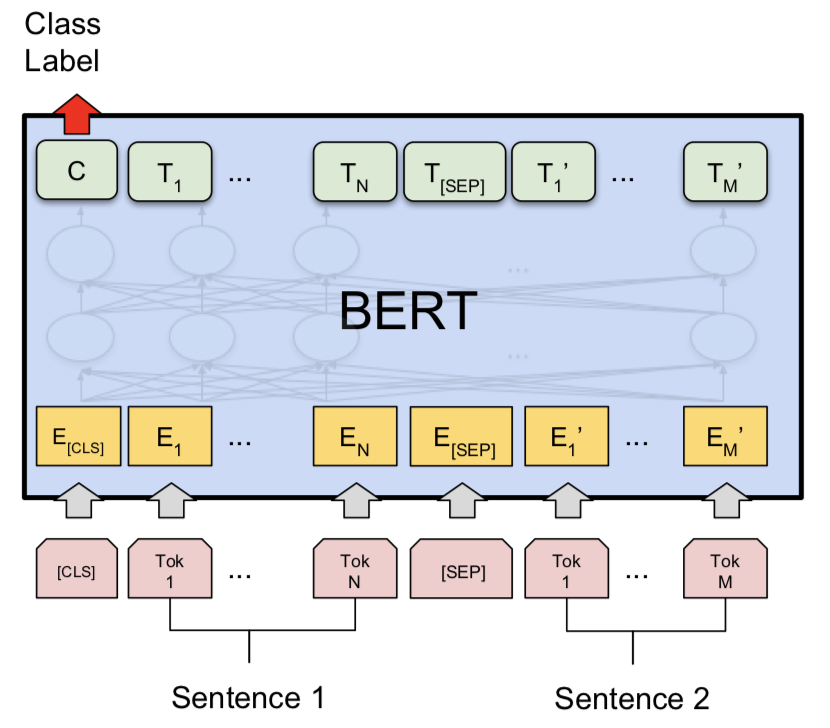

### Day 31: POS Classification with BiLSTM

Part-of-Speech (PoS) tagging, is a task of labelling each word in a sentence with its appropriate part of speech. This code covers the basic workflow. We'll learn how to: load data, create train/test/validation splits, build a vocabulary, create data iterators, define a model and implement the train/evaluate/test loop and run time (inference) tagging.

The model used is a Multi Layer Bi-directional LSTM network

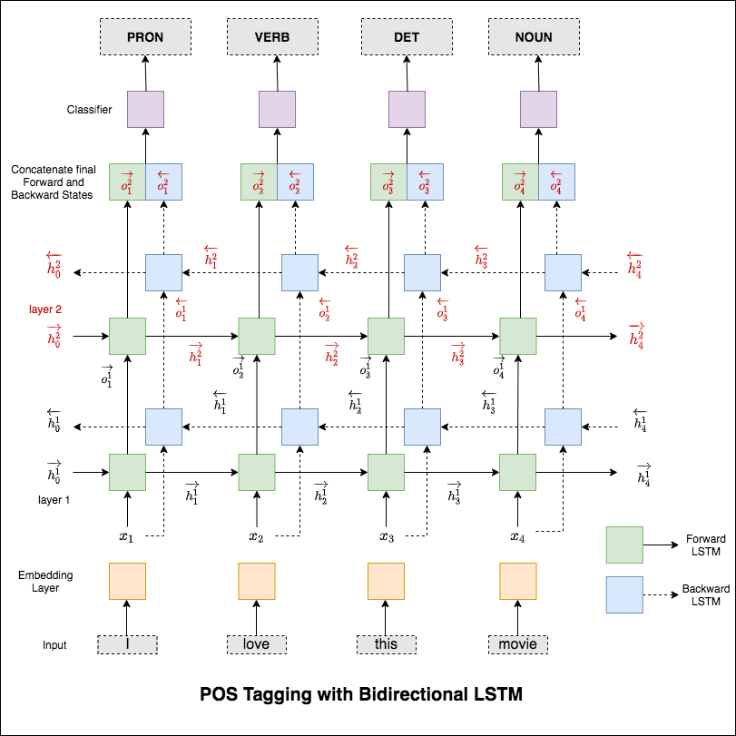

### Day 32: POS tagging with Transformer

After trying the RNN approach, POS tagging with Transformer based architecture is explored. Since the Transformer contains both Encoder and Decoder and for the sequence labeling task only `Encoder` will be sufficient. As the data is small having 6 layers of Encoder will overfit the data. So a 3-layer Transformer Encoder model was used.

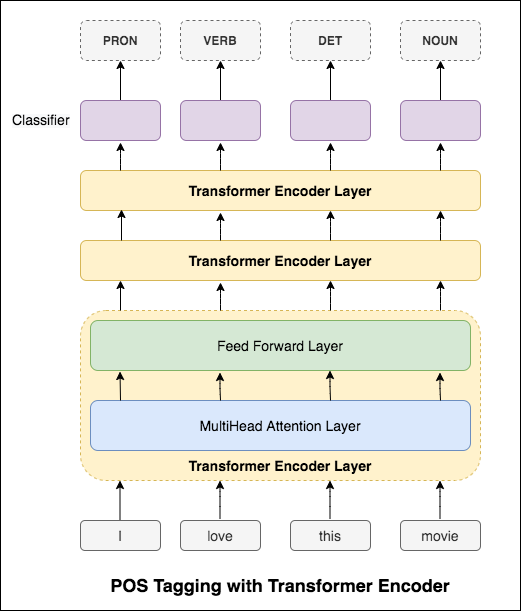

### Day 33: POS tagging with BERT

After trying POS tagging with Transformer Encoder, POS Tagging with pre-trained BERT model is exploed. It achieved test accuracy of `91%`.

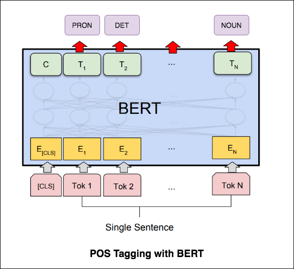

### Day 44: NLI with BiLSTM

The goal of natural language inference (NLI), a widely-studied natural language processing task, is to determine if one given statement (a premise) semantically entails another given statement (a hypothesis).

A basic model with Siamese BiLSTM network is implemeted

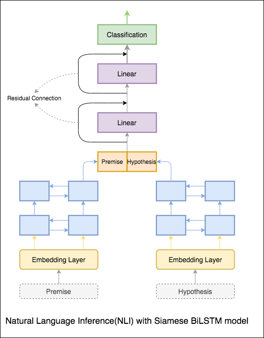

This can be treated as base-line setup. A test accuracy of `76.84%` was achieved.

### Day 45: NLI with Attention

In the previous notebook, the final hidden states of Premise and Hypothesis as the representations from LSTM. Now instead of taking the final hidden states, attention will be computed across all the input tokens and a final weighted vector is taken as the representation of Premise and Hypothesis. 

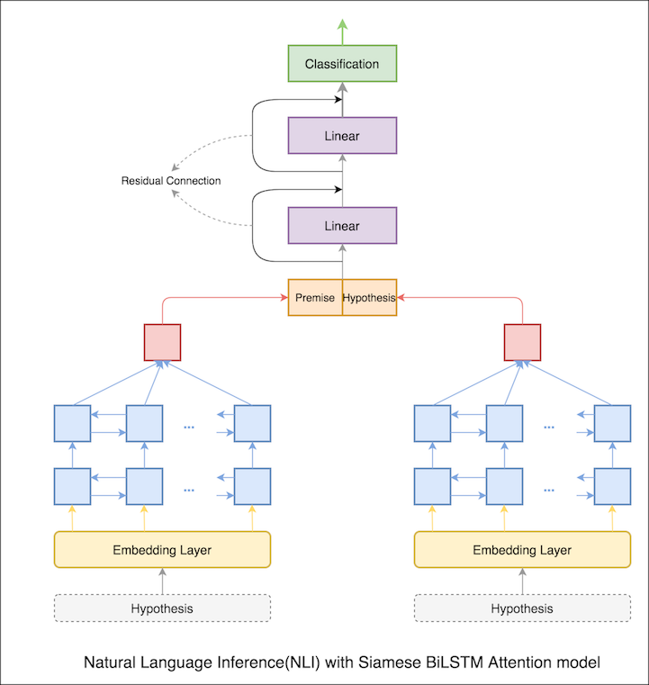

The test accuracy increased from `76.84%` to `79.51%`.

Checkout the code in `applications/classification` folder

## Generation based Applications

### Day 10: Name Generation with LSTM

A character-level LSTM language model is used. That is, we’ll give the LSTM a huge chunk of names and ask it to model the probability distribution of the next character in the sequence given a sequence of previous characters. This will then allow us to generate new name one character at a time

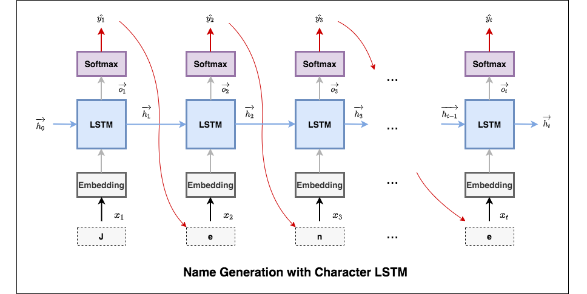

Checkout the code in `applications/generation` folder

### Day 11: Basic Machine Translation: German to English

The most common sequence-to-sequence (seq2seq) models are encoder-decoder models, which commonly use a recurrent neural network (RNN) to encode the source (input) sentence into a single vector. In this notebook, we'll refer to this single vector as a context vector. We can think of the context vector as being an abstract representation of the entire input sentence. This vector is then decoded by a second RNN which learns to output the target (output) sentence by generating it one word at a time.

Checkout the code in `applications/generation` folder

### Day 12: Improved Machine Translation: German to English

After trying the basic machine translation which has text perplexity `36.68`, following techniques have been experimented and a test perplexity `7.041`.

- GRU is used instead of LSTM
- Single layer
- Context vector is sent to decoder rnn along with decoder input embedding
- Context vector is sent to classifier along with the decoder hidden state

Checkout the code in `applications/generation` folder

### Day 15: Machine Translation with Bahdanau Attention: German to English

The attention mechanism was born to help memorize long source sentences in neural machine translation (NMT). Rather than building a single context vector out of the encoder's last hidden state, attention is used to focus more on the relevant parts of the input while decoding a sentence. The context vector will be created by taking encoder outputs and the `previous hidden state` of the decoder rnn.

### Day 16: Masking, Packing padded inputs, Attention Visualization, BLEU on MT: German to English

Enhancements like masking (ignoring the attention over padded input), packing padded sequences (for better computation), attention visualization and BLEU metric on test data are implemented.

### Day 19: Machine Translation with Transformer: German to English

The Transformer, a model architecture eschewing recurrence and instead relying entirely on an attention mechanism to draw global dependencies between input and output is used to do Machine translation from German to English

### Day 20: Self Attention Visualization

Run time translation (Inference) and attention visualization are added for the transformer based machine translation model.

### Day 34: Basic Utterance Generation

Utterance generation is an important problem in NLP, especially in question answering, information retrieval, information extraction, conversation systems, to name a few. It could also be used to create synthentic training data for many NLP problems.

The most common used model for this kind of application is sequence-to-sequence network. A basic 2 layer LSTM was used.

### Day 35: Utterance Generation with Attention

The attention mechanism will help in memorizing long sentences. Rather than building a single context vector out of the encoder's last hidden state, attention is used to focus more on the relevant parts of the input while decoding a sentence. The context vector will be created by taking encoder outputs and the `hidden state` of the decoder rnn.

After trying the basic LSTM apporach, Utterance generation with attention mechanism was implemented. Inference (run time generation) was also implemented.

### Day 36: Visualization of Attention

While generating the a word in the utterance, decoder will attend over encoder inputs to find the most relevant word. This process can be visualized.

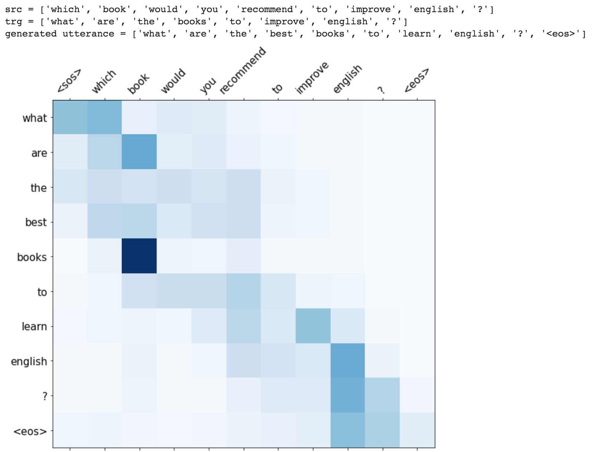

### Day 37: Utterance Generation with Beam Search

One of the ways to mitigate the repetition in the generation of utterances is to use Beam Search. By choosing the top-scored word at each step (greedy) may lead to a sub-optimal solution but by choosing a lower scored word that may reach an optimal solution.

Instead of greedily choosing the most likely next step as the sequence is constructed, the beam search expands all possible next steps and keeps the k most likely, where k is a user-specified parameter and controls the number of beams or parallel searches through the sequence of probabilities.

### Day 38: Utterance Generation with Coverage

Repetition is a common problem for sequenceto-sequence models, and is especially pronounced when generating a multi-sentence text. In coverage model, we maintain a
coverage vector `c^t`, which is the sum of attention distributions over all previous decoder timesteps

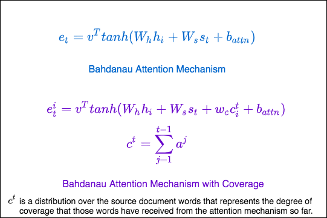

This ensures that the attention mechanism’s current decision (choosing where to attend next) is informed by a reminder of its previous decisions (summarized in c^t). This should make it easier for the attention mechanism to avoid repeatedly attending to the same locations, and thus avoid generating repetitive text.

### Day 39: Utterance Generation with Transformer

The Transformer, a model architecture eschewing recurrence and instead relying entirely on an attention mechanism to draw global dependencies between input and output is used to do generate utterance from a given sentence. The training time was also lot faster `4x` times compared to RNN based architecture.

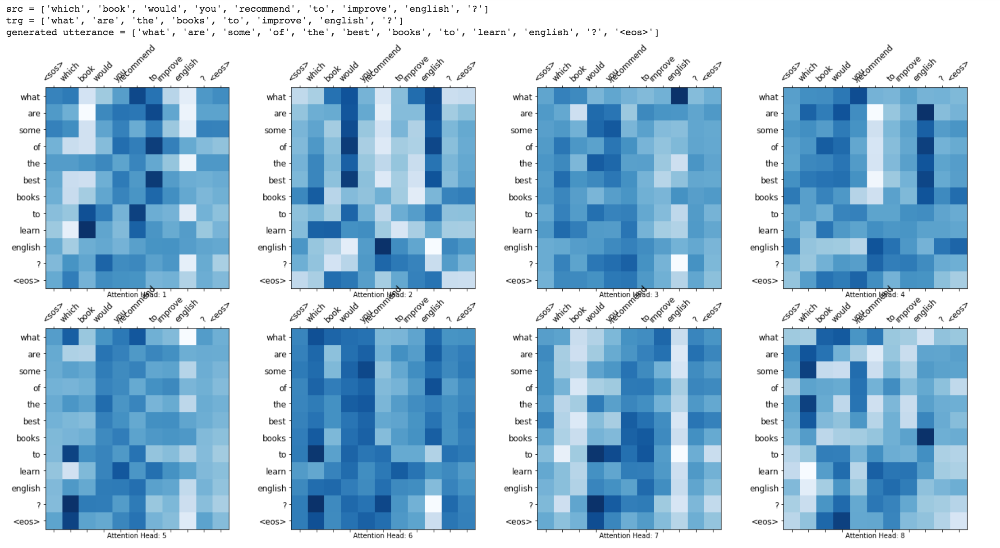

### Day 40: Beam Search in Utterance Generation with Transformer

Added beam search to utterance generation with transformers. With beam search, the generated utterances are more diverse and can be more than 1 (which is the case of the greedy approach). This implemented was better than naive one implemented previously.

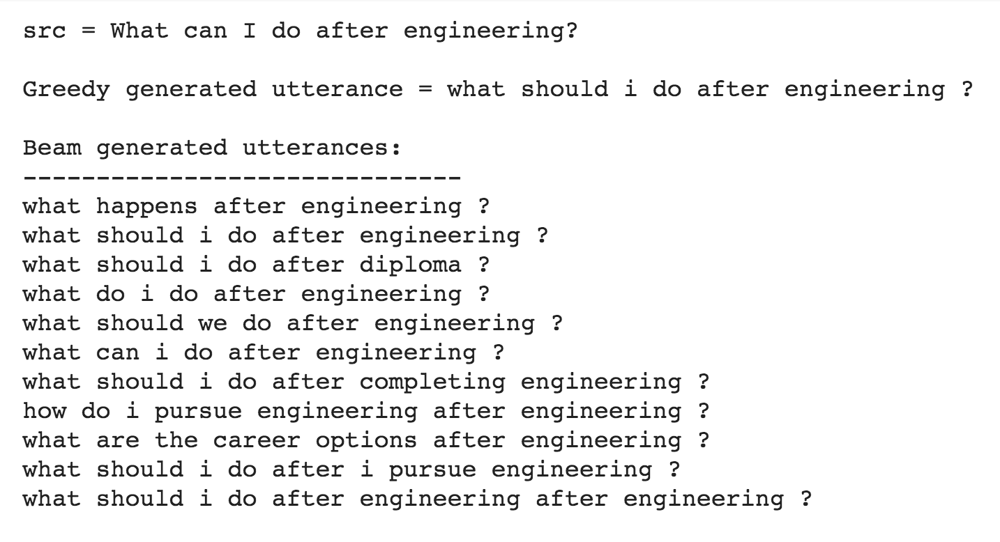

### Day 41: Utterance Generation with BPE Tokenization

Utterance generation using BPE tokenization instead of Spacy is implemented.

Today, subword tokenization schemes inspired by BPE have become the norm in most advanced models including the very popular family of contextual language models like BERT, GPT-2,RoBERTa, etc.

BPE brings the perfect balance between character and word-level hybrid representations which makes it capable of managing large corpora. This behavior also enables the encoding of any rare words in the vocabulary with appropriate subword tokens without introducing any “unknown” tokens.

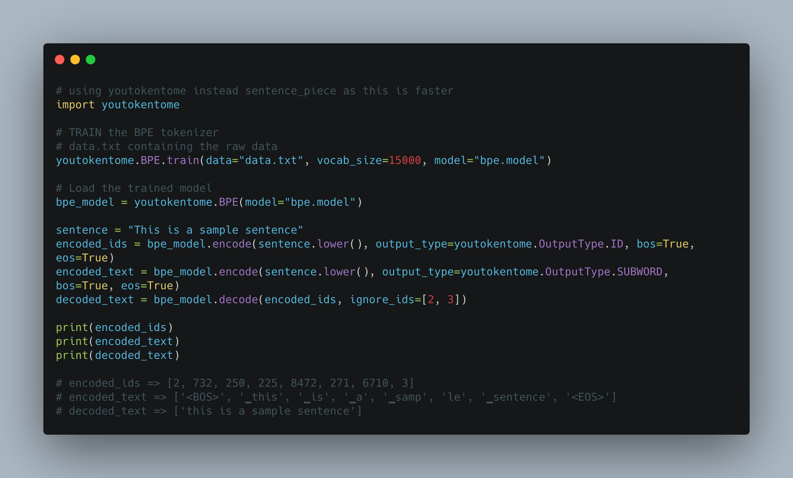

### Day 42: Utterance Generation using Streamlit

Converted the Utterance Generation into an app using streamlit. The pre-trained model trained on the Quora dataset is available now.

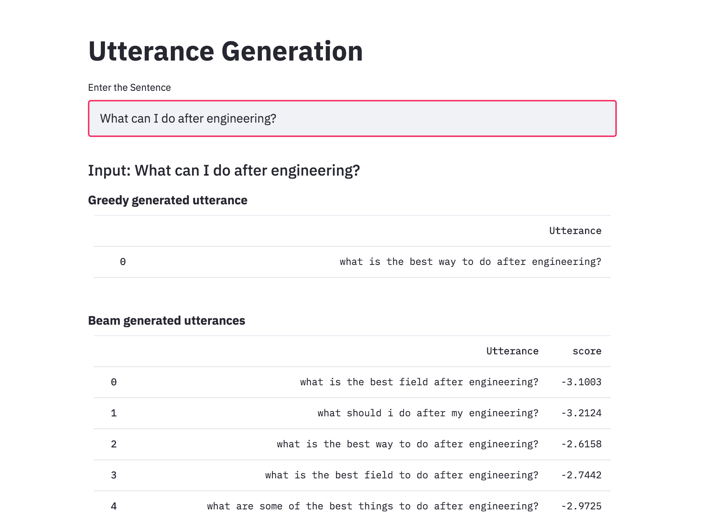

### Day 43: General Utterance Generation

Till now the Utterance Generation is trained using the `Quora Question Pairs` dataset, which contains sentences in the form of questions. When given a normal sentence (which is not in a question format) the generated utterances are very poor. This is due the `bias` induced by the dataset. Since the model is only trained on question type sentences, it fails to generate utterances in case of normal sentences. In order to generate utterances for a normal sentence, `COCO` dataset is used to train the model.
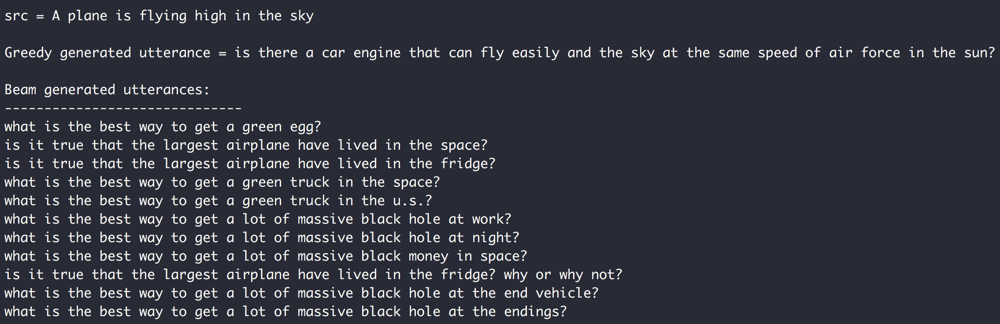

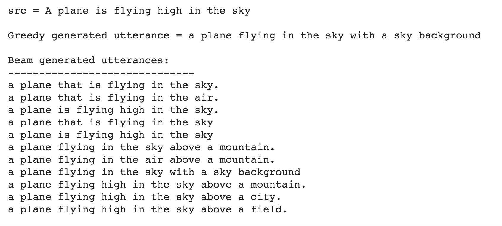

Checkout the code in `applications/generation` folder

## Ranking Based Applications

### Day 30: Covid-19 Browser

There was a kaggle problem on [covid-19 research challenge](https://www.kaggle.com/allen-institute-for-ai/CORD-19-research-challenge) which has over `1,00,000 +` documents. This freely available dataset is provided to the global research community to apply recent advances in natural language processing and other AI techniques to generate new insights in support of the ongoing fight against this infectious disease. There is a growing urgency for these approaches because of the rapid acceleration in new coronavirus literature, making it difficult for the medical research community to keep up.

The procedure I have taken is to convert the `abstracts` into a embedding representation using [`sentence-transformers`](https://github.com/UKPLab/sentence-transformers/). When a query is asked, it will converted into an embedding and then ranked across the abstracts using `cosine` similarity.

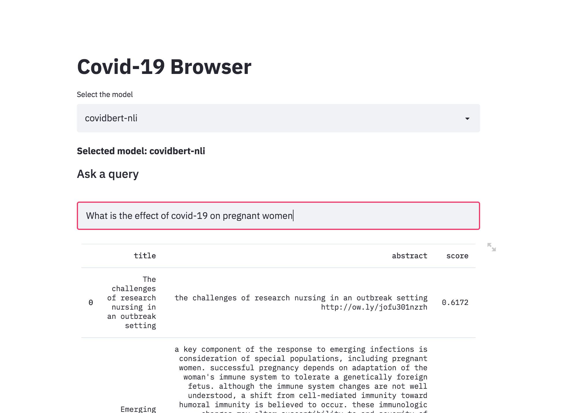
