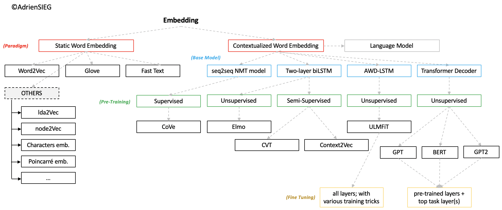

<h1 align="center" style="font-size:80px">
    100 Days of NLP
</h1>

 > There is nothing magic about magic. The magician merely understands something simple which doesn’t appear to be simple or natural to the untrained audience. Once you learn how to hold a card while making your hand look empty, you only need practice before you, too, can “do magic.” – Jeffrey Friedl in the book Mastering Regular Expressions

**Note: Please raise an issue for any suggestions, corrections, and feedback.**

## Tokenization in NLP

### Day 1

The process of converting textual data to tokens, is one of the most important step in NLP. Tokenization using the following methods has been explored:

- [Spacy](https://spacy.io/usage/linguistic-features#tokenization)
- [Byte Pair Encoding (Sentencepiece)](https://github.com/google/sentencepiece)
- [Unigram Encoding (Sentencepiece)](https://github.com/google/sentencepiece)
- [Torchtext](https://pytorch.org/text/data_utils.html)
- [Tokenizers](https://github.com/huggingface/tokenizers)

Checkout the code in `tokenization` folder

## Word Embeddings

A word embedding is a learned representation for text where words that have the same meaning have a similar representation. It is this approach to representing words and documents that may be considered one of the key breakthroughs of deep learning on challenging natural language processing problems.

### Day 2: Word2Vec

Word2Vec is one of the most popular pretrained word embeddings developed by Google. Depending on the way the embeddings are learned, Word2Vec is classified into two approaches:

- Continuous Bag-of-Words (CBOW)
- Skip-gram model

### Day 3: GloVe

GloVe is another commonly used method of obtaining pre-trained embeddings. GloVe aims to achieve two goals:

- Create word vectors that capture meaning in vector space
- Takes advantage of global count statistics instead of only local information

Checkout the code in `embeddings` folder