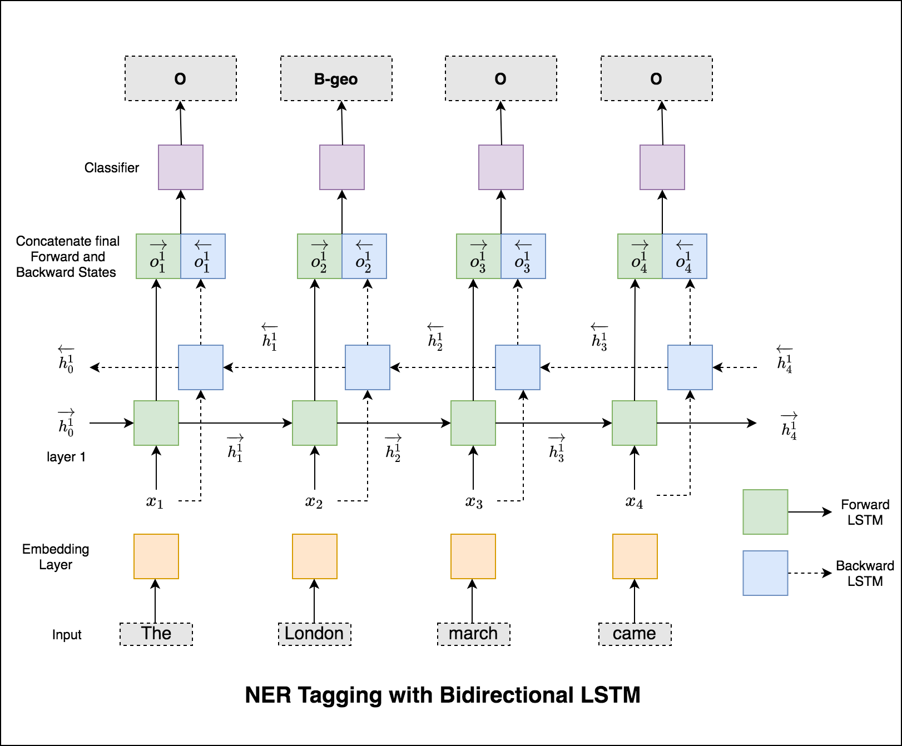
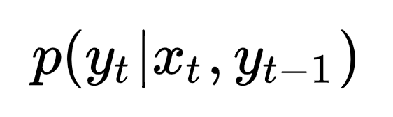
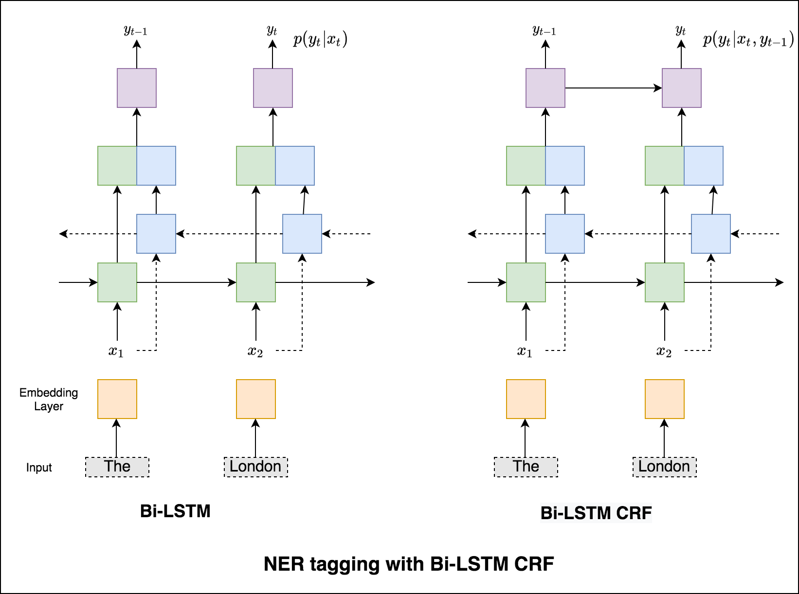
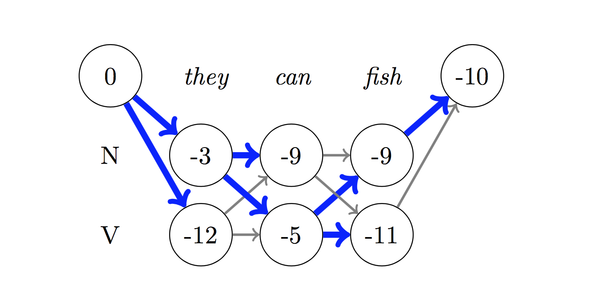
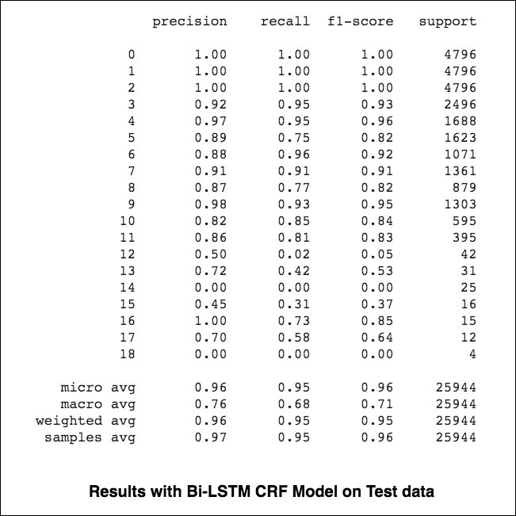
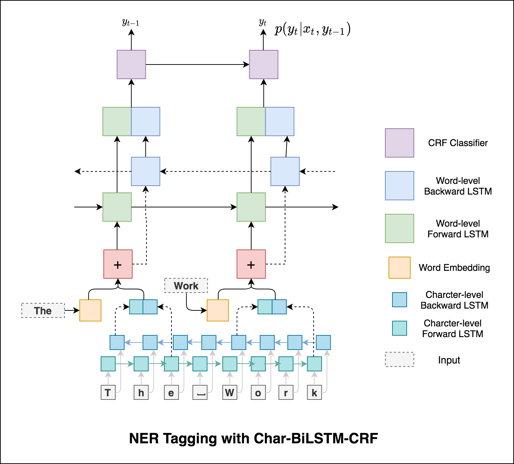
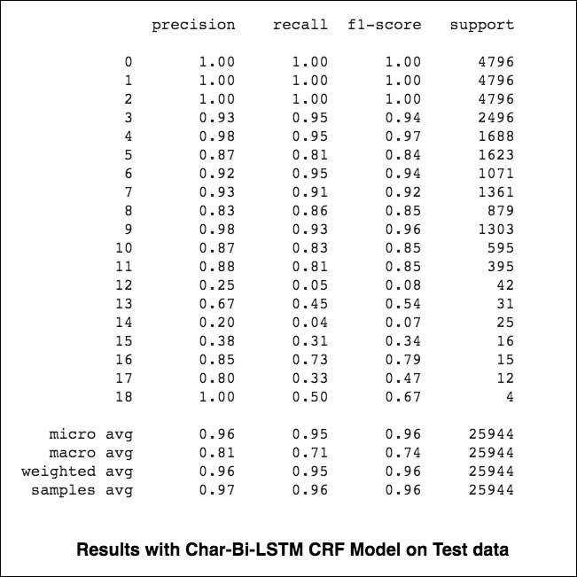
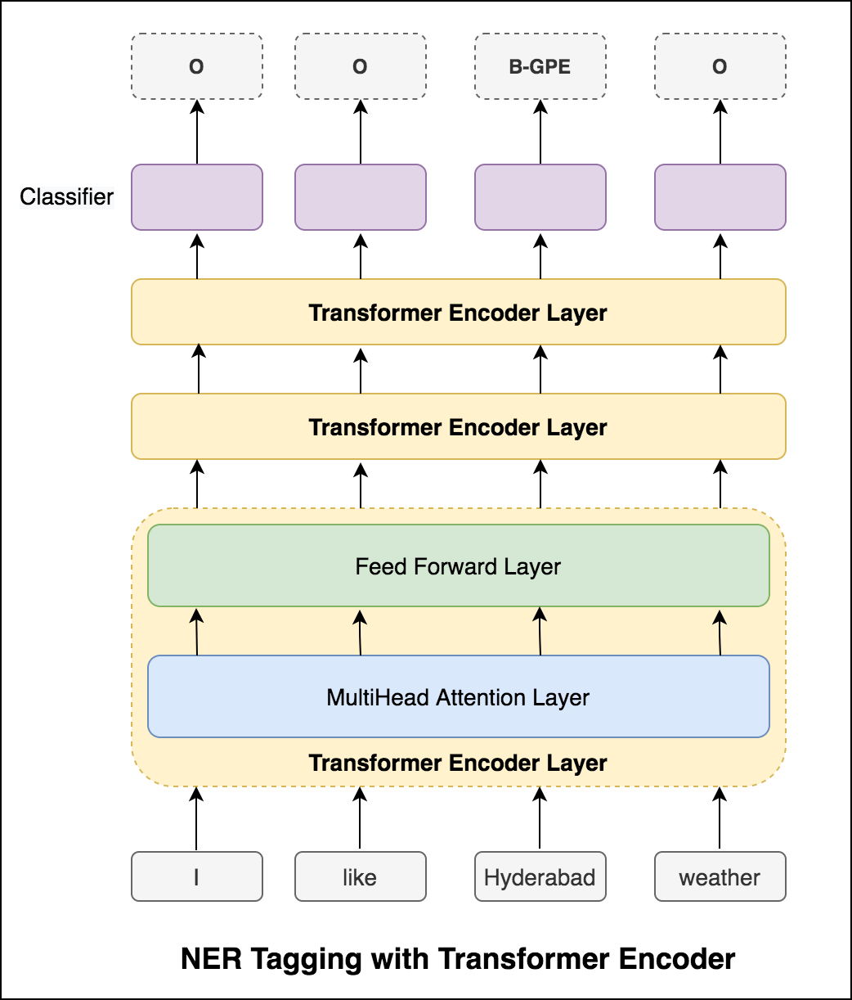
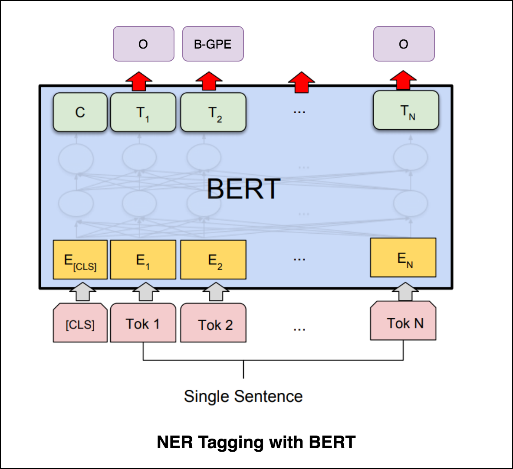

# NER Tagging

Named-Entity-Recognition (NER) tagging, is a task of labelling each word in a sentence with its appropriate entity.

## NER tagging with BiLSTM.ipynb

This code covers the basic workflow. We'll see how to: load data, create train/test/validation splits, build a vocabulary, create data iterators, define a model and implement the train/evaluate/test loop and train, test the model.

The model used is a Bi-directional LSTM network

The NER dataset is taken from [kaggle](https://www.kaggle.com/abhinavwalia95/entity-annotated-corpus) contains the following entities:

- `geo`: Geographical Entity
- `org`: Organization
- `per`: Person
- `gpe`: Geopolitical Entity
- `tim`: Time indicator
- `art`: Artifact
- `eve`: Event
- `nat`: Natural Phenomenon
- `o`: Other

A test accuracy of `96.7%` is achieved without the use of pre-trained embeddings. With that it might improve more.

*Note: Accuracy might not be a good metric as most of the data contains `O` tag. Different metrics like `precision`, `recall`, `f1` would give more insights.*

#### Resources

- [LSTM](https://github.com/graviraja/100-Days-of-NLP/blob/master/architectures/RNN.ipynb)
- [NER dataset](https://www.kaggle.com/abhinavwalia95/entity-annotated-corpus)

## NER tagging with BiLSTM-CRF.ipynb

In the case of Sequence tagging (NER) the tag of a current word might depend on previous word's tag. (ex: New York).

Without a CRF, we would have simply used a single linear layer to transform the output of the Bidirectional LSTM into scores for each tag. These are known as `emission scores`, which are a representation of the likelihood of the word being a certain tag.

Probability of a tag depends only on the input:

A CRF calculates not only the emission scores but also the `transition scores`, which are the likelihood of a word being a certain tag considering the previous word was a certain tag. Therefore the transition scores measure how likely it is to transition from one tag to another.

Probability of a tag depends on the input and previously predicted token:

For decoding, `Viterbi` algorithm is used.

Since we're using CRFs, we're not so much predicting the right label at each word as we are predicting the right label sequence for a word sequence. Viterbi Decoding is a way to do exactly this – find the most optimal tag sequence from the scores computed by a Conditional Random Field.

Results:

Micro and macro-averages (for whatever metric) will compute slightly different things, and thus their interpretation differs. A macro-average will compute the metric independently for each class and then take the average (hence treating all classes equally), whereas a micro-average will aggregate the contributions of all classes to compute the average metric. In a multi-class classification setup, micro-average is preferable if you suspect there might be class imbalance (i.e you may have many more examples of one class than of other classes).

#### Resources

- [Medium Blog post on CRF (Must read)](https://towardsdatascience.com/implementing-a-linear-chain-conditional-random-field-crf-in-pytorch-16b0b9c4b4ea)
- [BiLSTM - CRF model paper](https://arxiv.org/pdf/1508.01991.pdf)
- [CRF Video Explanation](https://www.youtube.com/watch?v=GF3iSJkgPbA)
- [code reference](https://github.com/Gxzzz/BiLSTM-CRF)
- [Vitebri decoding](https://github.com/sgrvinod/a-PyTorch-Tutorial-to-Sequence-Labeling#viterbi-decoding)
- [Metric explanation](https://datascience.stackexchange.com/questions/15989/micro-average-vs-macro-average-performance-in-a-multiclass-classification-settin)

## NER tagging with Char-BiLSTM-CRF.ipynb

Using sub-word information in our tagging task because it can be a powerful indicator of the tags, whether they're parts of speech or entities. For example, it may learn that adjectives commonly end with "-y" or "-ul", or that places often end with "-land" or "-burg".

Therefore, our sequence tagging model uses both

- `word-level` information in the form of word embeddings.
- `character-level` information up to and including each word in both directions.

Results:

## NER tagging with Transformer.ipynb

After trying the RNN approach, NER tagging with Transformer based architecture is explored. Since the Transformer contains both Encoder and Decoder and for the sequence labeling task only `Encoder` will be sufficient. A 3-layer Transformer Encoder model was used.

## NER tagging with BERT.ipynb

After trying NER tagging with Transformer Encoder, NER Tagging with pre-trained `bert-base-cased` model is explored.

