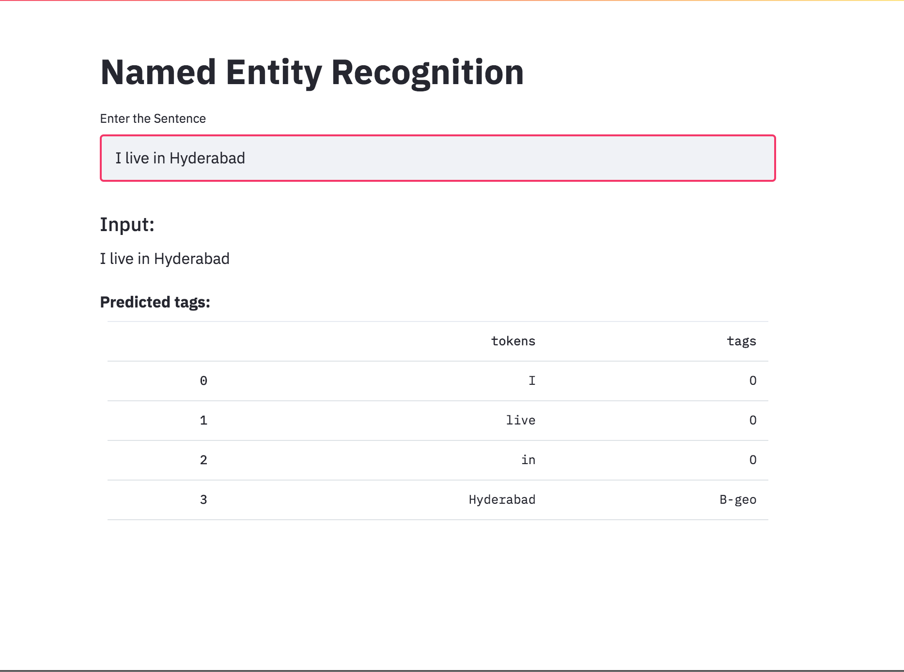

# Named Entity Recognition

Named-Entity-Recognition (NER) tagging, is a task of labelling each word in a sentence with its appropriate entity.

The NER dataset is taken from [kaggle](https://www.kaggle.com/abhinavwalia95/entity-annotated-corpus) contains the following entities:

- `geo`: Geographical Entity
- `org`: Organization
- `per`: Person
- `gpe`: Geopolitical Entity
- `tim`: Time indicator
- `art`: Artifact
- `eve`: Event
- `nat`: Natural Phenomenon
- `o`: Other

## Setup

```code
pip install -r requirements.txt
```

## Running the application

Make sure the **`model.pt`** and the `vocab` files are present in the `models` folder.

```
streamlit run app.py
```


