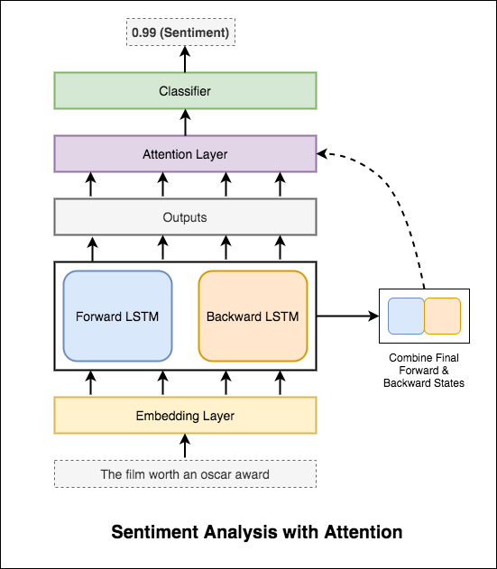
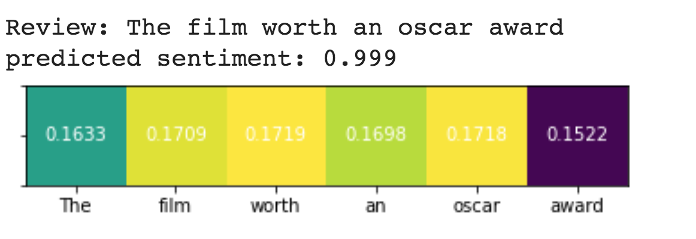
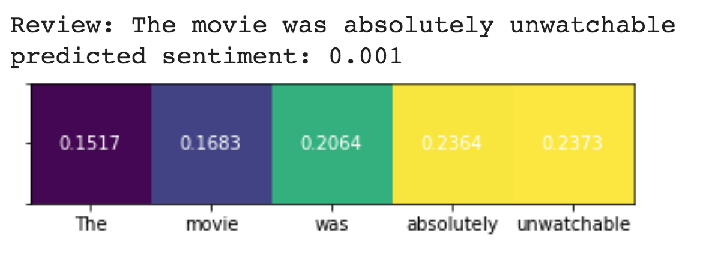
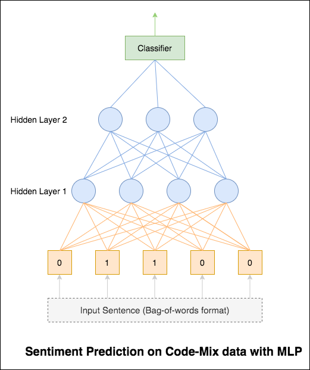
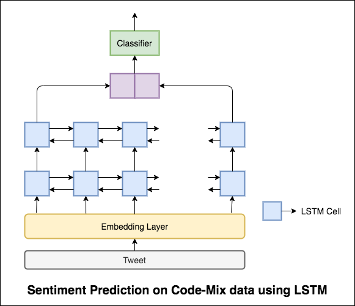
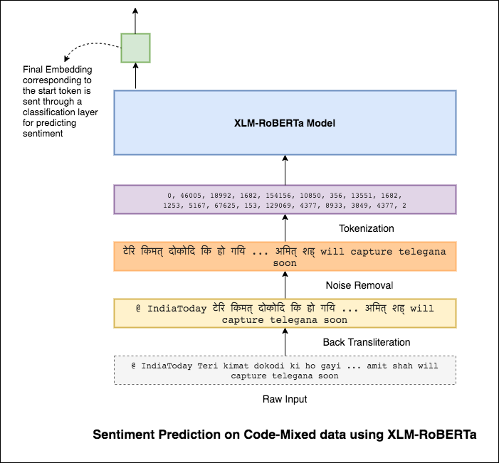
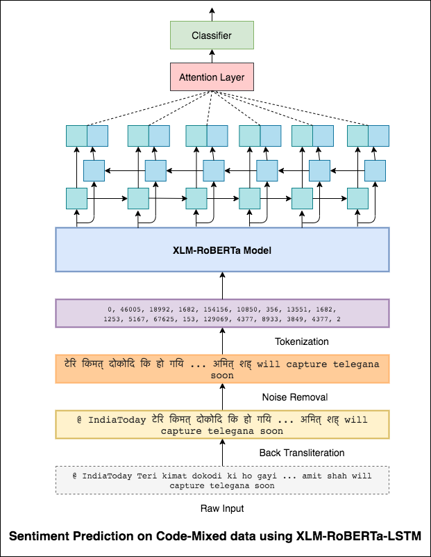

# Sentiment Analysis

Sentiment analysis refers to the use of natural language processing, text analysis, computational linguistics, and biometrics to systematically identify, extract, quantify, and study affective states and subjective information.

## IMDB - Dataset of 50K Movie Reviews

This is a dataset for binary sentiment classification containing a set of 25,000 highly polar movie reviews for training and 25,000 for testing. 

### Simple Sentiment Analysis.ipynb

This notebook covers the basic workflow. We'll learn how to: load data, create train/test/validation splits, build a vocabulary, create data iterators, define a model and implement the train/evaluate/test loop.

The model used is a simple RNN network

Since the model is simple, performance will be poor. But this will be improved in the subsequent experiments.

#### Resources

- [IMDB dataset](http://ai.stanford.edu/~amaas/data/sentiment/)
- [Ben Trevett Sentiment analysis](https://github.com/bentrevett/pytorch-sentiment-analysis)
- [My notebook on RNN](https://github.com/graviraja/100-Days-of-NLP/blob/master/architectures/RNN.ipynb)

### Improved Sentiment Analysis.ipynb

After trying the basic RNN which gives a test_accuracy less than 50%, following techniques have been experimented and a test_accuracy above 88% is achieved.

The model used is a Multi Layer Bidirectional LSTM network

#### Resources

- [Packed Padded Sequences](https://github.com/graviraja/pytorch-sample-codes/blob/master/pad_sequences.py)
- [Embeddings](https://github.com/graviraja/100-Days-of-NLP/tree/master/embeddings)
- [Multi Layer RNN](https://github.com/graviraja/100-Days-of-NLP/blob/master/architectures/RNN.ipynb)
- [Dropout - Andrew NG tutorial](https://www.youtube.com/watch?v=ARq74QuavAo)
- [Ben Trevett Notebook](https://github.com/bentrevett/pytorch-sentiment-analysis/blob/master/2%20-%20Upgraded%20Sentiment%20Analysis.ipynb)

### Sentiment Analysis with Attention.ipynb

Attention helps in focusing on the relevant input when predicting the sentiment of the input. Bahdanau attention was used with taking the outputs of LSTM and concatenating the final forward & backward hidden state. Without using the pre-trained word embeddings, test accuracy of `88%` is achieved.

The architecture looks like this:

Attention can also be visualized

#### Resources

- [Bahdananu Attention](https://github.com/graviraja/100-Days-of-NLP/blob/applications/sentiment/architectures/bahdanau_attention.py)

### Sentiment Analysis with BERT.ipynb

BERT obtains new state-of-the-art results on eleven natural language processing tasks. Transfer learning in NLP has triggered after the release of BERT model. In this notebook, we will explore how to use BERT for Sentiment Analysis.

Sentiment analysis using BERT can be summarized as:
- Tokenize the sentence using BERT tokenizer (word-piece)
- Add the specical tokens used in BERT
- Send the tokenized sentence through BERT layers
- Take the final hidden state of the `[CLS]` token
- Send this hidden state to through a simple linear classifier which predicts the sentiment

*Note: The amount of time taken by BERT model to train the IMDB dataset is huge compared to the previous implementations. GPU is required to train the model*

## Sentimix: Sentiment Analysis for Code-Mixed Social Media Text

Mixing languages, also known as code-mixing, is a norm in multilingual societies. Multilingual people, who are non-native English speakers, tend to code-mix using English-based phonetic typing and the insertion of anglicisms in their main language.

Although current language technologies are primarily built for English, non-native English speakers combine English and other languages when they use social media. In fact, statistics show that half of the messages on Twitter are in a language other than English. This evidence suggests that other languages, including multilinguiality and code-mixing, need to be considered by the NLP community.

The task is to predict the sentiment of a given code-mixed tweet. The sentiment labels are positive, negative, or neutral, and the code-mixed languages will be English-Hindi.

Dataset consists of 14,000 training samples and 3,000 test samples.

### Basic Sentimix using MLP.ipynb

This notebook contains:

- Reading and Parsing the data
- Visualization of data
- Data Cleaning
- Splitting the data into train, val and test splits
- Converting the data into numerical format using BoW (Bag of Words)
- Using a basic Multi-Layer Perceptron model for sentiment classification
- Evaluation on test data

Using the simple MLP model, following metrics were achieved on test data.

- `Precision`: 0.58

- `Recall`: 0.58

- `F1-Score`: 0.58

#### References

- [Semeval 2020 Task 9 Sentimix](https://ritual-uh.github.io/sentimix2020/)
- [Sentimix dataset](https://github.com/gopalanvinay/thesis-vinay-gopalan)

### Sentimix using LSTM.ipynb

LSTM model was used for sentiment prediction. Following metrics were achieved on test data.

- `Precision`: 0.57

- `Recall`: 0.58

- `F1-Score`: 0.57

The results were actually less compared to a basic MLP model. One of the reason might be LSTM is not able to learn the relationships among the words in a sentence due to the highly diverse nature of the Code-mixed data.

### Sentimix with XLM-RoBERTa.ipynb

As the LSTM is not able to learn the relationships between the words in a code-mixed sentence due to the highly diverse nature of the Code-mixed data and no pre-trained embeddings are used, the F1 score is less.

To alleviate this problem XLM-RoBERTa model (which has been pre-trained on 100 languages) is being used to encode the sentence. In order to use the XLM-RoBERTa model, the sentence needs to be in a proper language. So first the Hinglish words need to be converted to the Hindi (Devanagari) form. Then noise (unnecesary tags, urls, etc) is removed.

Following metrics were achieved on test data.

- `Precision`: 0.59

- `Recall`: 0.60

- `F1-Score`: 0.59

Methods to improve this will be explored later on.

### Sentimix with XLM-RoBERTa-LSTM-Attention.ipynb

The final output from XLM-RoBERTa model were used as input embeddings to bi-directional LSTM model. An attention layer, which takes the outputs from LSTM layer, produces a weighted representation of the input, which is then passed through a classifier for predicting the sentiment of the sentence.

Following metrics were achieved on test data.

- `Precision`: 0.64

- `Recall`: 0.64

- `F1-Score`: 0.64

#### References

- [Google transliterated data](https://github.com/keshav22bansal/BAKSA_IITK)