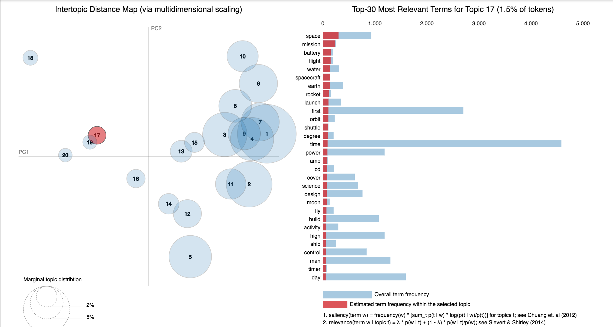

# 20 Newsgroup Dataset

This dataset is a collection newsgroup documents. The 20 newsgroups collection has become a popular data set for experiments in text applications of machine learning techniques, such as text classification and text clustering.

This is a list of the 20 newsgroups:

- comp.graphics
- comp.os.ms-windows.misc
- comp.sys.ibm.pc.hardware
- comp.sys.mac.hardware
- comp.windows.x rec.autos
- rec.motorcycles
- rec.sport.baseball
- rec.sport.hockey sci.crypt
- sci.electronics
- sci.med
- sci.space
- misc.forsale talk.politics.misc
- talk.politics.guns
- talk.politics.mideast talk.religion.misc
- alt.atheism
- soc.religion.christian

## Topic Identification in News using LDA.ipynb

Topic modeling is an unsupervised machine learning technique that’s capable of scanning a set of documents, detecting word and phrase patterns within them, and automatically clustering word groups and similar expressions that best characterize a set of documents.

LDA’s approach to topic modeling is it considers each document as a collection of topics in a certain proportion. And each topic as a collection of keywords, again, in a certain proportion.

Once you provide the algorithm with the number of topics, all it does it to rearrange the topics distribution within the documents and keywords distribution within the topics to obtain a good composition of topic-keywords distribution.

20 Newsgroup dataset was used and only the articles are provided to identify the topics. Topic Modelling algorithms will provide for each topic what are the important words. It is upto us to infer the topic name.

#### Resources

- [LDA](https://github.com/graviraja/100-Days-of-NLP/tree/master/architectures#topic-modelling-using-ldaipynb)
- [Machinelearningplus blog on LDA](https://www.machinelearningplus.com/nlp/topic-modeling-gensim-python/)

## Improved Topic Identification in News using LDA.ipynb

Choosing the number of topics is a difficult job in Topic Modelling. In order to choose the optimal number of topics, grid search is performed on various hypermeters. In order to choose the best model the model having the best perplexity score is choosed.

A good topic model will have non-overlapping, fairly big sized blobs for each topic. 

- LDA using scikit-learn is implemented.
- Inference (predicting the topic of a given sentence) is also implemented.

#### Resources
- [Machinelearningplus blog on LDA](https://www.machinelearningplus.com/nlp/topic-modeling-python-sklearn-examples/)

## Topic Identification in News using LSA.ipynb

We would clearly expect that the words that appear most frequently in one topic would appear less frequently in the other - otherwise that word wouldn't make a good choice to separate out the two topics. Therefore, we expect the topics to be `orthogonal`.

Latent Semantic Analysis (LSA) uses SVD. You will sometimes hear topic modelling referred to as LSA.

The SVD algorithm factorizes a matrix into one matrix with `orthogonal columns` and one with `orthogonal rows` (along with a diagonal matrix, which contains the relative importance of each factor).

Notes:
- SVD is a determined dimension reduction algorithm
- LDA is a probability-based generative model

*Personal Opinion: Though LDA is computationally expensive, the topics (keywords) provided by it are better than LSA.*

#### Resources
- [SVD Tutorial by Rachel Thomas](https://www.youtube.com/watch?v=tG3pUwmGjsc&list=PLtmWHNX-gukKocXQOkQjuVxglSDYWsSh9&index=2)
- [Image reference](https://research.fb.com/fast-randomized-svd/)
- [Analyticsvidhya blog post on LSA](https://www.analyticsvidhya.com/blog/2018/10/stepwise-guide-topic-modeling-latent-semantic-analysis)
