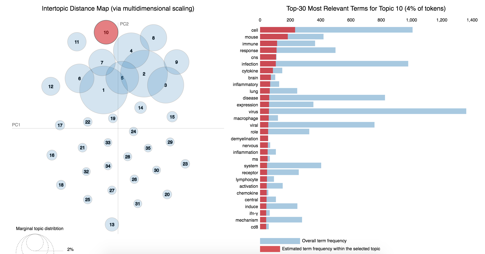

# Covid research paper finding

There was a kaggle problem on [covid-19 research challenge](https://www.kaggle.com/allen-institute-for-ai/CORD-19-research-challenge) which has over `1,00,000 +` documents. This freely available dataset is provided to the global research community to apply recent advances in natural language processing and other AI techniques to generate new insights in support of the ongoing fight against this infectious disease. There is a growing urgency for these approaches because of the rapid acceleration in new coronavirus literature, making it difficult for the medical research community to keep up.

Download the `metadata.csv` from [here](https://www.kaggle.com/allen-institute-for-ai/CORD-19-research-challenge).

## Covid article finding using LDA.ipynb

Finding the relevant article from a covid-19 research article [corpus of 50K+ documents](https://www.kaggle.com/allen-institute-for-ai/CORD-19-research-challenge) using LDA is explored.

The documents are first clustered into different topics using LDA. For a given query, dominant topic will be found using the trained LDA. Once the topic is found, most relevant articles will be fetched using the `jensenshannon` distance.

Only abstracts from the `metadata.csv` was used for the LDA model training. 
LDA model was trained using 35 topics.

As we can see the topics are overlapping, the model can be further improved.

The model is providing decent results only.

Further Improvements:
- Removing papers which are in languages other than english (This is adding noise to the current model).
- Grid Search in finding better number of topics
- Using the body text while training the LDA model

#### Resources

- [Kaggle notebook](https://www.kaggle.com/danielwolffram/topic-modeling-finding-related-articles)