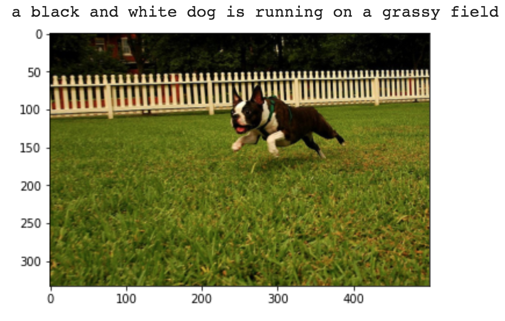
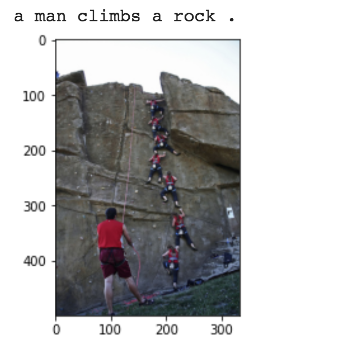
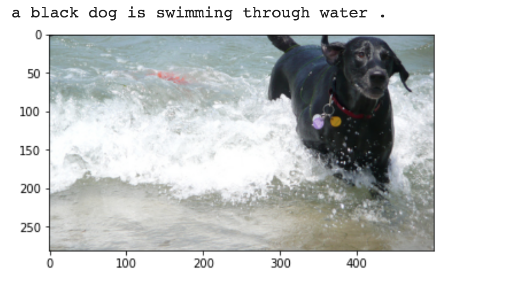

# Image Captioning

Image Captioning is the process of generating a textual description of an image. It uses both Natural Language Processing and Computer Vision techniques to generate the captions.

The encoder-decoder framework is widely used for this task. The image encoder is a convolutional neural network (CNN). The decoder is a recurrent neural network(RNN) which takes in the encoded image and generates the caption.

## Basic Image Captioning.ipynb

In this notebook, the resnet-152 model pretrained on the ILSVRC-2012-CLS image classification dataset is used as the encoder. The decoder is a long short-term memory (LSTM) network.

Flickr8K dataset is used. It contains 8092 images, each image having 5 captions.

Few examples of generated caption for a given image:

#### Resources

- [Flickr8k Dataset](https://www.kaggle.com/adityajn105/flickr8k?rvi=1)
- [Reference code](https://github.com/yunjey/pytorch-tutorial/tree/master/tutorials/03-advanced/image_captioning)

## Image Captioning with Attention.ipynb

In this notebook, the resnet-101 model pretrained on the ILSVRC-2012-CLS image classification dataset is used as the encoder. The decoder is a long short-term memory (LSTM) network. Attention is implemented. Instead of the simple average, we use the weighted average across all pixels, with the weights of the important pixels being greater. This weighted representation of the image can be concatenated with the previously generated word at each step to generate the next word of the caption.

Code improvements:
    - Added attention
    - Splitted data into training, validation instead of using all the data
    - Training, validation methods

#### Resources
- [Image reference](https://github.com/sgrvinod/a-PyTorch-Tutorial-to-Image-Captioning)

## Image Captioning with Beam Search.ipynb

Instead of greedily choosing the most likely next step as the caption is constructed, the beam search expands all possible next steps and keeps the k most likely, where k is a user-specified parameter and controls the number of beams or parallel searches through the sequence of probabilities.

#### Resources
- [Reference code](https://github.com/sgrvinod/a-PyTorch-Tutorial-to-Image-Captioning)

## Image Captioning with BPE Tokenization.ipynb

Today, subword tokenization schemes inspired by BPE have become the norm in most advanced models including the very popular family of contextual language models like BERT, GPT-2,RoBERTa, etc.

BPE brings the perfect balance between character and word-level hybrid representations which makes it capable of managing large corpora. This behavior also enables the encoding of any rare words in the vocabulary with appropriate subword tokens without introducing any “unknown” tokens.

BPE was used in order to tokenize the captions instead of using nltk.

Code improvements:
    - Tokenization using BPE
    - Using karapathy's train, val, test splits

#### Resources
- [Karapathy image captioning splits](http://cs.stanford.edu/people/karpathy/deepimagesent/caption_datasets.zip)
