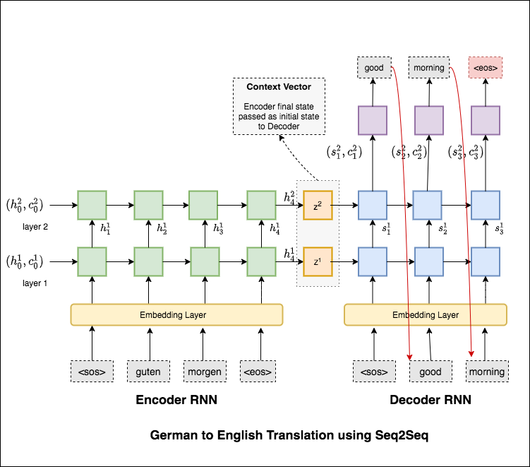
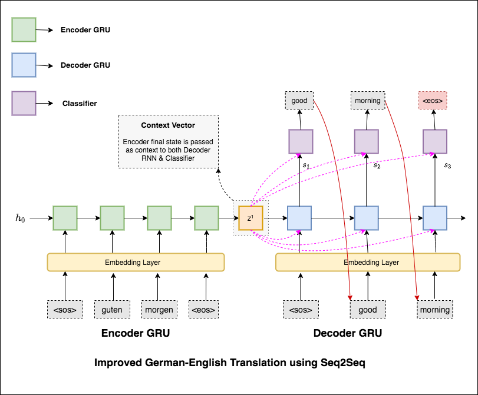
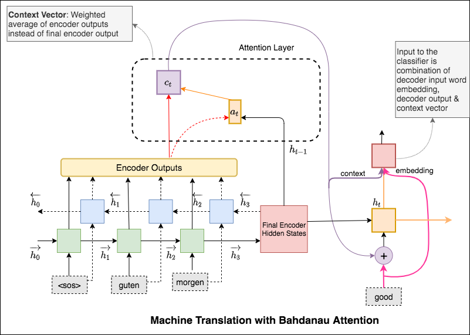
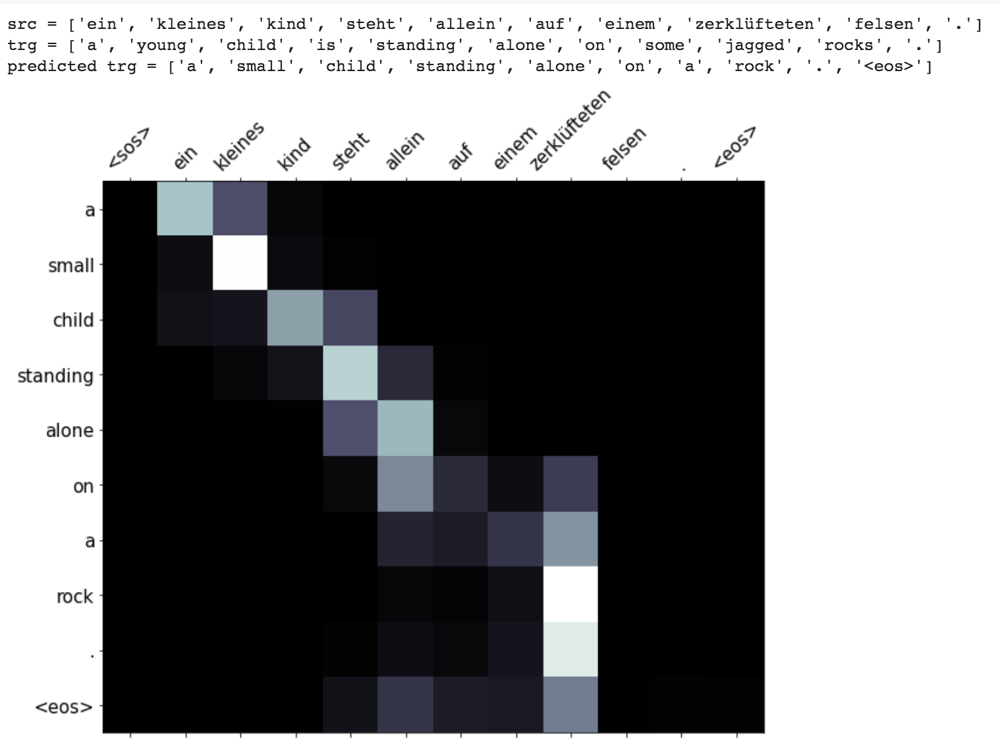
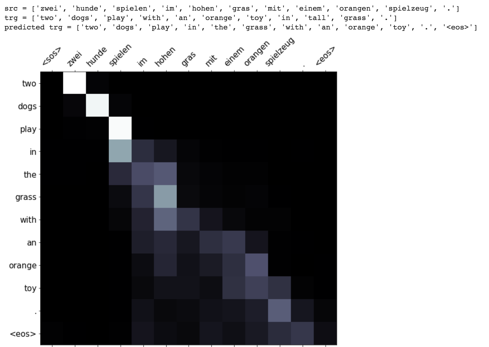
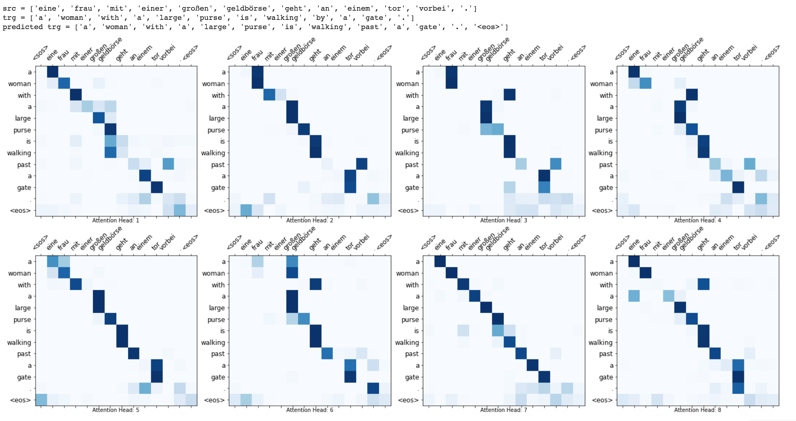

# Machine Translation

Machine Translation (MT) is the task of automatically converting one natural language into another, preserving the meaning of the input text, and producing fluent text in the output language. Ideally, a source language sequence is translated into target language sequence. 

## Basic Machine Translation.ipynb

The most common sequence-to-sequence (seq2seq) models are encoder-decoder models, which commonly use a recurrent neural network (RNN) to encode the source (input) sentence into a single vector. In this notebook, we'll refer to this single vector as a context vector. We can think of the context vector as being an abstract representation of the entire input sentence. This vector is then decoded by a second RNN which learns to output the target (output) sentence by generating it one word at a time.

#### Resources

- [Unreasonable effectiveness of RNN](http://karpathy.github.io/2015/05/21/rnn-effectiveness/)
- [Ben Trevett Seq2Seq](https://github.com/bentrevett/pytorch-seq2seq)
- [Multi30K dataset](https://pytorch.org/text/datasets.html#multi30k)
- [Sequence to Sequence Learning with Neural Networks paper](https://arxiv.org/abs/1409.3215)

## Improved Machine Translation.ipynb

After trying the basic machine translation which has text perplexity `36.68`, following techniques have been experimented and a test perplexity `7.041`.

- GRU is used instead of LSTM
- Single layer
- Context vector is sent to decoder rnn along with decoder input embedding
- Context vector is sent to classifier along with the decoder hidden state

#### Resources

- [Unreasonable effectiveness of RNN](http://karpathy.github.io/2015/05/21/rnn-effectiveness/)
- [Ben Trevett Seq2Seq](https://github.com/bentrevett/pytorch-seq2seq)
- [Multi30K dataset](https://pytorch.org/text/datasets.html#multi30k)
- [Learning Phrase Representations using RNN Encoder-Decoder for Statistical Machine Translation paper](https://arxiv.org/pdf/1406.1078.pdf)

## Machine Translation with Bahdanau Attention.ipynb

The attention mechanism was born to help memorize long source sentences in neural machine translation (NMT). Rather than building a single context vector out of the encoder's last hidden state, attention is used to focus more on the relevant parts of the input while decoding a sentence. The context vector will be created by taking encoder outputs and the `previous hidden state` of the decoder rnn.

#### Resources

- [Ben Trevett Seq2Seq](https://github.com/bentrevett/pytorch-seq2seq)
- [Bahdanau Attention](https://github.com/graviraja/100-Days-of-NLP/blob/master/architectures/bahdanau_attention.py)

## Masking, Packing, Visualization, BLEU on MT.ipynb

Enhancements like masking (ignoring the attention over padded input), packing padded sequences (for better computation), attention visualization and BLEU metric on test data are implemented.

## Machine Translation with Transformer.ipynb

The Transformer, a model architecture eschewing recurrence and instead relying entirely on an attention mechanism to draw global dependencies between input and output is used to do Machine translation from German to English. A test perplexity of `5.677` was achieved with even lesser training time.

Self-attention also can be visualized.

#### Resources

- [Ben Trevett Seq2Seq](https://github.com/bentrevett/pytorch-seq2seq)
- [Google AI Blog on Transformer](https://ai.googleblog.com/2017/08/transformer-novel-neural-network.html)
