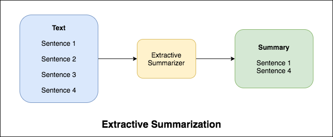
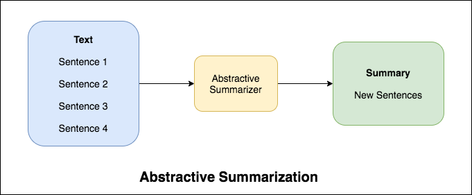

# Text Summarization

Automatic text summarization is the task of producing a concise and fluent summary while preserving key information content and overall meaning

There are broadly two different approaches that are used for text summarization:

- Extractive Summarization
- Abstractive Summarization

**`Extractive Summarization`**: We identify the important sentences or phrases from the original text and extract only those from the text. Those extracted sentences would be our summary. The below diagram illustrates extractive summarization:

**`Abstractive Summarization`**: Here, we generate new sentences from the original text. This is in contrast to the extractive approach we saw earlier where we used only the sentences that were present. The sentences generated through abstractive summarization might not be present in the original text. The below diagram illustrates abstractive summarization:

The Encoder-Decoder architecture is mainly used to solve the sequence-to-sequence (Seq2Seq) problems (summarization) where the input and output sequences are of different lengths.

## News Summarization with T5.ipynb

Have you come across the mobile app `inshorts`? It’s an innovative news app that converts news articles into a 60-word summary.  And that is exactly what we are going to do in this notebook.

