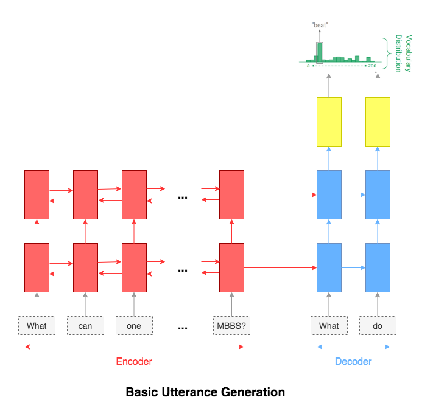
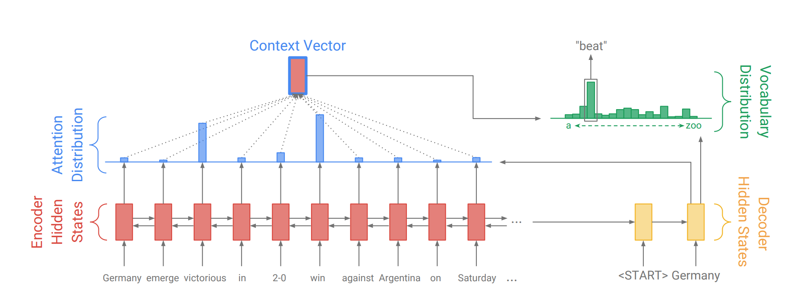

# Utterance Generation

Utterance generation is an important problem in NLP, especially in question answering, information retrieval, information extraction, conversation systems, to name a few. It could also be used to create synthentic training data for many NLP problems.

## Basic Utterance Generation.ipynb

The most common sequence-to-sequence (seq2seq) models are encoder-decoder models, which commonly use a recurrent neural network (RNN) to encode the source (input) sentence into a single vector. In this notebook, we'll refer to this single vector as a context vector. We can think of the context vector as being an abstract representation of the entire input sentence. This vector is then decoded by a second RNN which learns to output the target (output) sentence by generating it one word at a time. A two-layer LSTM was used.

## Utterance Generation with Attention.ipynb

The attention mechanism will help in memorizing long sentences. Rather than building a single context vector out of the encoder's last hidden state, attention is used to focus more on the relevant parts of the input while decoding a sentence. The context vector will be created by taking encoder outputs and the `hidden state` of the decoder rnn.

After trying the basic LSTM apporach, Utterance generation with attention mechanism was implemented. Inference (run time generation) was also implemented.

#### Resources

- [Bahdanau Attention Mechanism](https://github.com/graviraja/100-Days-of-NLP/blob/master/architectures/bahdanau_attention.py)
- [Luong Attention Mechanism](https://github.com/graviraja/100-Days-of-NLP/blob/master/architectures/luong_attention.py)
- [Image ref](https://arxiv.org/pdf/1704.04368.pdf)