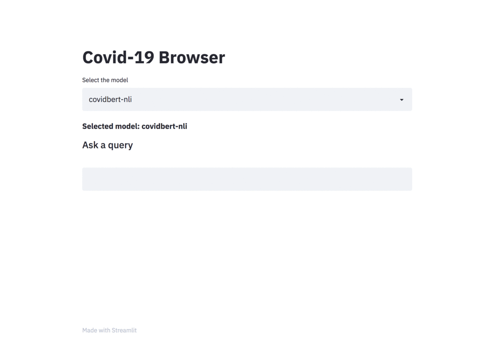

# Covid-19 Browser

There was a kaggle problem on [covid-19 research challenge](https://www.kaggle.com/allen-institute-for-ai/CORD-19-research-challenge) which has over `1,00,000 +` documents. This freely available dataset is provided to the global research community to apply recent advances in natural language processing and other AI techniques to generate new insights in support of the ongoing fight against this infectious disease. There is a growing urgency for these approaches because of the rapid acceleration in new coronavirus literature, making it difficult for the medical research community to keep up.

The procedure I have taken is to convert the `abstracts` into a embedding representation using [`sentence-transformers`](https://github.com/UKPLab/sentence-transformers/). When a query is asked, it will converted into an embedding and then ranked across the abstracts using `cosine` similarity.


Various models already fine-tuned on Natural Language Inference are available to perform the search:

I am using the models provided by **[`gsarti`](https://github.com/gsarti/covid-papers-browser)** for ranking purposes

- **[`scibert-nli`](https://huggingface.co/gsarti/scibert-nli)**, a fine-tuned version of AllenAI's [SciBERT](https://github.com/allenai/scibert).

- **[`biobert-nli`](https://huggingface.co/gsarti/biobert-nli)**, a fine-tuned version of [BioBERT](https://github.com/dmis-lab/biobert) by J. Lee et al.

- **[`covidbert-nli`](https://huggingface.co/gsarti/covidbert-nli)**, a fine-tuned version of Deepset's [CovidBERT](https://huggingface.co/deepset/covid_bert_base).

- **[`clinicalcovidbert-nli`](https://huggingface.co/manueltonneau/clinicalcovid-bert-nli)** a fine-tuned version of covidbert.

All the models are trained on [SNLI](https://nlp.stanford.edu/projects/snli/) [3] and [MultiNLI](https://www.nyu.edu/projects/bowman/multinli/) using the [`sentence-transformers` library](https://github.com/UKPLab/sentence-transformers/) to produce universal sentence embeddings. Embeddings are subsequently used to perform semantic search on CORD-19.

## Setup

```code
pip install -r requirements.txt
```

## Running the application

Download the `metadata.csv` from [here](https://www.kaggle.com/allen-institute-for-ai/CORD-19-research-challenge) and then run the following command.

```
streamlit run app.py
```




#### References

- [Covid paper browser](https://github.com/gsarti/covid-papers-browser)
- [Sentence transformers](https://github.com/UKPLab/sentence-transformers/) 