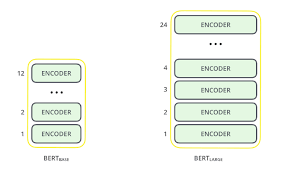

<h1 align="center" style="font-size:80px">
    Architectures & Techniques in NLP
</h1>

**Note: This is not a comprehensive list of architectures used in NLP. There may be even more ways, I am providing the most generally used methods. Please feel free to provide feedback (or) suggesting other ways.**

## RNN.ipynb: Understanding RNN, LSTM, GRU.

Recurrent networks - RNN, LSTM, GRU have proven to be one of the most important unit in NLP applications because of their architecture. There are many problems where the sequence nature needs to be remembered like in order to predict an emotion in the scene, previous scenes needs to be remembered.

My focus here will be on how to use RNN's and variants in PyTorch and also understanding the inputs, outputs of single layer, multi-layer, uni-directional and bi-directional RNN's and it's variants.

Please go through the following resources for better conceptual understanding:
- [Colah blog on LSTMs](https://colah.github.io/posts/2015-08-Understanding-LSTMs/)
- [Edwin Chen blog on exploring LSTMs](http://blog.echen.me/)
- [Illustrated guide to LSTMs and GRUs](https://towardsdatascience.com/illustrated-guide-to-lstms-and-gru-s-a-step-by-step-explanation-44e9eb85bf21)

## pack_padded_sequences.py: Reduce the un-necessary computations in RNN

When training RNN (LSTM or GRU or vanilla-RNN), it is difficult to batch the variable length sequences. For ex: if length of sequences in a size 6 batch is [6, 2, 9, 4, 8, 3], you will pad all the sequences and that will results in 6 sequences of length 9. You would end up doing 54 computation (6x9), but you needed to do only 32 computations. Moreover, if you wanted to do something fancy like using a bidirectional-RNN it would be harder to do batch computations just by padding and you might end up doing more computations than required.

Instead, pytorch allows us to pack the sequence, internally packed sequence is a tuple of two lists. One contains the elements of sequences. Elements are interleaved by time steps and other contains the batch size at each step. This is helpful in recovering the actual sequences as well as telling RNN what is the batch size at each time step. This can be passed to RNN and it will internally optimize the computations.

Resources:
- [Harsh Trivedi gist](https://gist.github.com/HarshTrivedi/f4e7293e941b17d19058f6fb90ab0fec)
- [Stackoverflow post](https://stackoverflow.com/questions/51030782/why-do-we-pack-the-sequences-in-pytorch)
- [Image credits](https://github.com/sgrvinod/)

## Attention Mechanisms

The attention mechanism was born to help memorize long source sentences in neural machine translation (NMT). Rather than building a single context vector out of the encoder's last hidden state, attention is used to focus more on the relevant parts of the input while decoding a sentence. There are various types of attention mechanisms. Here I will point out the most used ones.

### Luong Attention

The context vector will be created by taking encoder outputs and the `current output` of the decoder rnn.

The attention score can be calculated in three ways. `dot`, `general` and `concat`.

Resources:

- [Floyd Hub article on attention mechanisms](https://blog.floydhub.com/attention-mechanism/)
- [Lilian Blog on attention mechanisms](https://lilianweng.github.io/lil-log/2018/06/24/attention-attention.html)
- [Luong Attention Paper](https://arxiv.org/abs/1508.04025)

### Bahdanau Attention

The context vector will be created by taking encoder outputs and the `previous hidden state` of the decoder rnn. The context vector is combined with decoder input embedding and fed as input to decoder rnn.

The Bahdanau attention is also called as `additive` attention.

Resources:

- [Floyd Hub article on attention mechanisms](https://blog.floydhub.com/attention-mechanism/)
- [Lilian Blog on attention mechanisms](https://lilianweng.github.io/lil-log/2018/06/24/attention-attention.html)
- [Bahdanau Attention Paper](https://arxiv.org/pdf/1409.0473.pdf)

## Transformer

Attention mechanisms have become an integral part of compelling sequence modeling and transduction models in various tasks, allowing modeling of dependencies without regard to their distance in the input or output sequences. Such attention mechanisms are used in conjunction with a recurrent network.

The Transformer, a model architecture eschewing recurrence and instead relying entirely on an attention mechanism to draw global dependencies between input and output.

Resources:

- [`Illustrated Transformer (Must read)`](http://jalammar.github.io/illustrated-transformer/)
- [Attention is all you need - paper](https://arxiv.org/pdf/1706.03762.pdf)
- [Reference code](https://github.com/bentrevett/pytorch-seq2seq/)

## GPT2.ipynb

The GPT-2 paper states that: 
> Natural language processing tasks, such as question answering, machine translation, reading comprehension, and summarization, are typically approached with supervised learning on taskspecific datasets. We demonstrate that language models begin to learn these tasks without any explicit supervision when trained on a new dataset of millions of webpages called WebText. Our largest model, GPT-2, is a 1.5B parameter Transformer that achieves state of the art results on 7 out of 8 tested language modeling datasets in a zero-shot setting but still underfits WebText. Samples from the model reflect these improvements and contain coherent paragraphs of text. These findings suggest a promising path towards building language processing systems which learn to perform tasks from their naturally occurring demonstrations.

The GPT-2 utilizes a 12-layer Decoder Only Transformer architecture.

There are different size variants of GPT-2

I merely replicated the code from Annotated GPT-2 post to understand the architecture.

Resources:

- [Illustrated GPT-2 by Jay Alammar](http://jalammar.github.io/illustrated-gpt2/)
- [Annotated GPT-2](https://amaarora.github.io/2020/02/18/annotatedGPT2.html)
- [GPT-2 Paper](https://cdn.openai.com/better-language-models/language_models_are_unsupervised_multitask_learners.pdf)
- [Open AI Blog](https://openai.com/blog/better-language-models/)
- [Hugging Face Transformers](https://github.com/huggingface/transformers)

## BERT.py

At the end of 2018 researchers at Google AI Language open-sourced a new technique for Natural Language Processing (NLP) called `BERT` (Bidirectional Encoder Representations from Transformers) —  a major breakthrough which took the Deep Learning community by storm because of its incredible performance.

Main take aways:

- Language modeling is an effective task for using unlabeled data to pretrain neural networks in NLP
- Traditional language models take the previous n tokens and predict the next one. In contrast, BERT trains a language model that takes both the previous and next tokens into account when predicting.

- BERT is also trained on a next sentence prediction task to better handle tasks that require reasoning about the relationship between two sentences (e.g. similar questions or not)

- BERT uses the Transformer architecture for encoding sentences.

- BERT performs better when given more parameters, even on small datasets.

Similar to GPT-2, different sizes of BERT are also available.

There are many good online available resources to understand the BERT architecure. I can't explain any better than that. So here I try to implement the basic version of BERT. Refer to the following resources for better understanding of BERT.

Resources:

- [BERT Explained - TowardsML](https://towardsml.com/2019/09/17/bert-explained-a-complete-guide-with-theory-and-tutorial/)
- [Demystifying BERT - Analytics Vidhya](https://www.analyticsvidhya.com/blog/2019/09/demystifying-bert-groundbreaking-nlp-framework/)
- [BERT paper dissected - ML Explained](https://mlexplained.com/2019/01/07/paper-dissected-bert-pre-training-of-deep-bidirectional-transformers-for-language-understanding-explained/)
- [Visual guide to BERT by Jay Alammar](http://jalammar.github.io/a-visual-guide-to-using-bert-for-the-first-time/)
- [BERT paper](https://arxiv.org/pdf/1810.04805.pdf)

## pointer_network.py

Pointer networks are sequence-to-sequence models where the output is discrete tokens corresponding to positions in an input sequence. The main differences between pointer networks and standard seq2seq models are:

- The output of pointer networks is discrete and correspond to positions in the input sequence

- The number of target classes in each step of the output depends on the length of the input, which is variable.

Pointer networks are suitable for problems like sorting, word ordering, or computational linguistic problems such as convex hulls and traveling sales person problems. One common characteristic for all these problems is that the size of the target dictionary varies depending on the input length.

Pointer network solves the problem of variable size output dictionaries using a mechanism of neural attention. It differs from the previous attention attempts in that, instead of using attention to blend hidden units of an encoder to a context vector at each decoder step, it uses attention as a pointer to select a member of the input sequence as the output.

Resources:

- [Pointer network paper](https://arxiv.org/pdf/1506.03134v1.pdf)
- [Pointer network explained](https://www.youtube.com/watch?v=gKD7FqkvXy0)
- [Blog by A paper A day](https://medium.com/@sharaf/a-paper-a-day-11-pointer-networks-59f7af1a611c)

## Topic Modelling using LDA.ipynb

One of the primary applications of natural language processing is to automatically extract what topics people are discussing from large volumes of text. Some examples of large text could be feeds from social media, customer reviews of hotels, movies, etc, user feedbacks, news stories, e-mails of customer complaints etc.

Knowing what people are talking about and understanding their problems and opinions is highly valuable to businesses, administrators, political campaigns. And it’s really hard to manually read through such large volumes and compile the topics.

Thus is required an automated algorithm that can read through the text documents and automatically output the topics discussed.

In this notebook, we will take a real example of the `20 Newsgroups` dataset and use LDA to extract the naturally discussed topics.

LDA’s approach to topic modeling is it considers each document as a collection of topics in a certain proportion. And each topic as a collection of keywords, again, in a certain proportion.

Once you provide the algorithm with the number of topics, all it does it to rearrange the topics distribution within the documents and keywords distribution within the topics to obtain a good composition of topic-keywords distribution.

Resources:

- [Youtube video on LDA](https://www.youtube.com/watch?v=3mHy4OSyRf0)
- [LDA Tutorial](https://www.youtube.com/watch?v=NYkbqzTlW3w)
- [Towardsdatascience blog on LDA](https://towardsdatascience.com/topic-modeling-and-latent-dirichlet-allocation-in-python-9bf156893c24)
- [Analyticsvidhya blog on LDA](https://www.analyticsvidhya.com/blog/2016/08/beginners-guide-to-topic-modeling-in-python/)
- [Machinelearningplus blog on LDA](https://www.machinelearningplus.com/nlp/topic-modeling-gensim-python/#4whatdoesldado)

## Principal Component Analysis(PCA).ipynb

PCA is fundamentally a dimensionality reduction technique that transforms the columns of a dataset into a new set features. It does this by finding a new set of directions (like X and Y axes) that explain the maximum variability in the data. This new system coordinate axes is called Principal Components (PCs).

Practically PCA is used for two reasons:

- **`Dimensionality Reduction`**: The information distributed across a large number of columns is transformed into principal components (PC) such that the first few PCs can explain a sizeable chunk of the total information (variance). These PCs can be used as explanatory variables in Machine Learning models.

- **`Visualize Data`**: Visualising the separation of classes (or clusters) is hard for data with more than 3 dimensions (features). With the first two PCs itself, it’s usually possible to see a clear separation.

Use the following resources to understand how PCA works:

- [PCA video by StatsQuest](https://www.youtube.com/watch?v=FgakZw6K1QQ)
- [Machinelearningplus blog on PCA](https://www.machinelearningplus.com/machine-learning/principal-components-analysis-pca-better-explained/)
- [Medium blog on PCA](https://medium.com/@jonathan_hui/machine-learning-singular-value-decomposition-svd-principal-component-analysis-pca-1d45e885e491)
