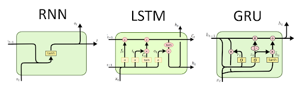

<h1 align="center" style="font-size:80px">
    Architectures & Techniques in NLP
</h1>

**Note: This is not a comprehensive list of architectures used in NLP. There may be even more ways, I am providing the most generally used methods. Please feel free to provide feedback (or) suggesting other ways.**

## RNN.ipynb: Understanding RNN, LSTM, GRU.

Recurrent networks - RNN, LSTM, GRU have proven to be one of the most important unit in NLP applications because of their architecture. There are many problems where the sequence nature needs to be remembered like in order to predict an emotion in the scene, previous scenes needs to be remembered.

My focus here will be on how to use RNN's and variants in PyTorch and also understanding the inputs, outputs of single layer, multi-layer, uni-directional and bi-directional RNN's and it's variants.

Please go through the following resources for better conceptual understanding:
- [Colah blog on LSTMs](https://colah.github.io/posts/2015-08-Understanding-LSTMs/)
- [Edwin Chen blog on exploring LSTMs](http://blog.echen.me/)
- [Illustrated guide to LSTMs and GRUs](https://towardsdatascience.com/illustrated-guide-to-lstms-and-gru-s-a-step-by-step-explanation-44e9eb85bf21)
