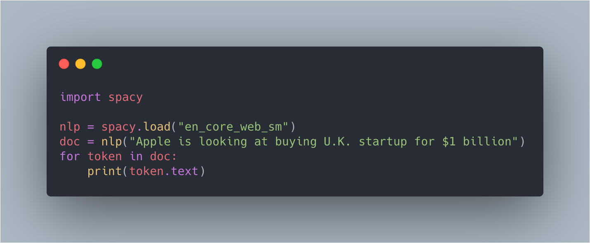
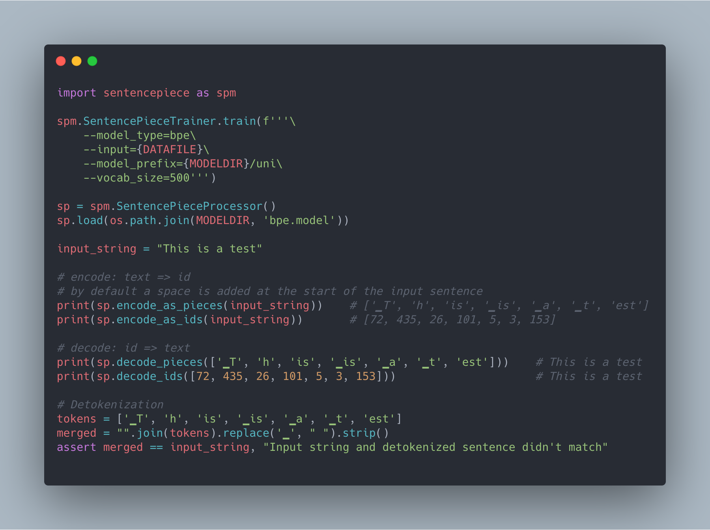
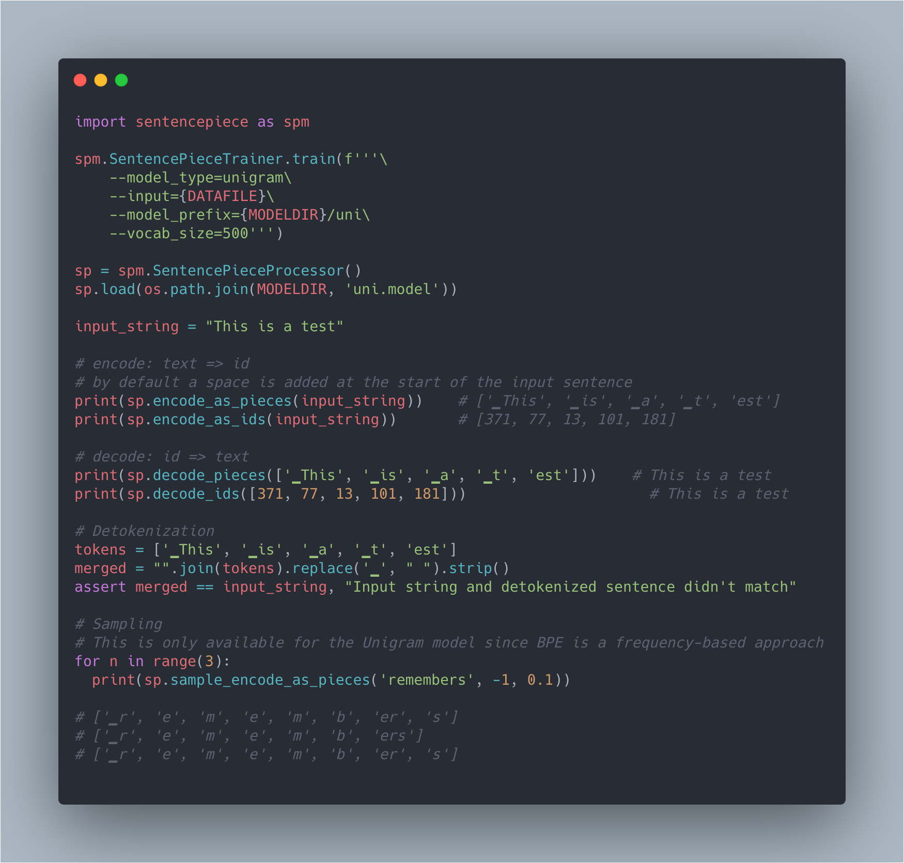
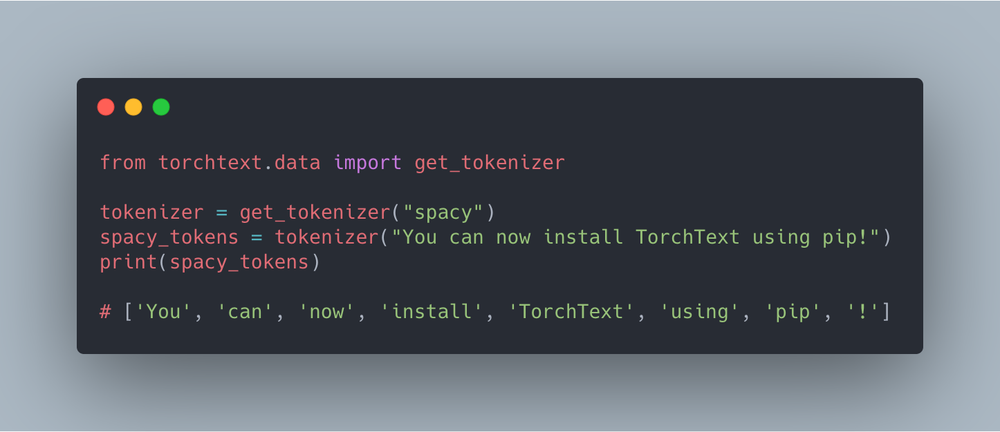

<h1 align="center" style="font-size:80px">
    Tokenization in NLP
</h1>

**Note: This is not a comprehensive list of tokenization methods. There may be even more ways to do the tokenization process, I am providing the most generally used methods. Please feel free to provide feedback (or) suggesting other ways.**

I highly recommend to go through the following resources.

- [Tokenization-nlp](https://blog.floydhub.com/tokenization-nlp/)

- [A deep dive into the wonderful world of preprocessing in nlp](https://mlexplained.com/2019/11/06/a-deep-dive-into-the-wonderful-world-of-preprocessing-in-nlp/)


### Data
The dataset used for tokenization is a free novel [“All Around the Moon”](http://www.gutenberg.org/cache/epub/16457/pg16457.txt) by Jules Verne in text format.


### Setup

I am using *`python 3.6.2`*

Run the following command to install relevant libraries
```
pip install -r requirements.txt
```

### Codes

#### 1. spacy_tokenization.py: Tokenization using spacy library.

The Spacy tokenizer is a modern tokenizer that is widely used for a good reason: it's fast, provides reasonable defaults, and is easily customizable.  




Spacy does the tokenization in the following way: 

First, the raw text is split on whitespace characters, similar to text.split(' '). Then, the tokenizer processes the text from left to right. On each substring, it performs two checks:

1. Does the substring match a tokenizer exception rule? For example, “don’t” does not contain whitespace, but should be split into two tokens, “do” and “n’t”, while “U.K.” should always remain one token.

2. Can a prefix, suffix or infix be split off? For example punctuation like commas, periods, hyphens or quotes.


We can customize the tokenizer by adding our rules and conditions. Checkout the documentation for more details [here](https://spacy.io/usage/linguistic-features#native-tokenizers)

#### 2. nltk_tokenization.py: Tokenization using nltk library

#### 3. bpe_tokenization.py: Tokenization using [Byte-Pair Encoding](https://arxiv.org/abs/1508.07909) algorithm.

Byte Pair Encoding (BPE) or diagram coding is a simple form of data compression in which the most common pair of consecutive bytes of data is replaced with a byte that does not occur within that data. 



Training is required to create BPE tokenizer. This [repo](https://github.com/bheinzerling/bpemb) contains pretrained BPE in 275 languages.

#### 4. unigram_tokenization.py: Tokenization using [Unigram Language Modeling](https://arxiv.org/pdf/1804.10959.pdf) algorithm.

The basic idea of this tokenizer is to train a unigram language model, assuming all words occur independent of each other. It then uses this model to find the most likely segmentation of each word. The advantage of this method is that it uses a probabilistic model underneath, meaning in addition to finding the most likely segmentation, you can sample segmentations from a probability distribution.




#### 5: torchtext_tokenization.py: Usage of torchtext library for tokenization.

Torchtext is a pytorch based package which consists of data processing utilities and popular datasets for natural language. We can configure the tokenizer with existing tokenization approaches like spacy, moses, subword, etc. (or) provide our own custom tokenizer.




#### 6: tokenizers_tokenization.py: Using Huggingface's [tokenizers](https://github.com/huggingface/tokenizers) library for tokenization

Provides an implementation of today's most used tokenizers, with a focus on performance and versatility.

A Tokenizer works as a pipeline, it processes some raw text as input and outputs an Encoding. The various steps of the pipeline are:

The Normalizer: in charge of normalizing the text. Common examples of normalization are the unicode normalization standards, such as NFD or NFKC.

The PreTokenizer: in charge of creating initial words splits in the text. The most common way of splitting text is simply on whitespace.

The Model: in charge of doing the actual tokenization. An example of a Model would be BPE or WordPiece.

The PostProcessor: in charge of post-processing the Encoding to add anything relevant that, for example, a language model would need, such as special tokens.

### References

- [Spacy Tokenization](https://spacy.io/usage/linguistic-features#tokenization)

- [Nltk Tokenization](https://www.nltk.org/api/nltk.tokenize.html)

- [Keras Tokenization](https://keras.io/api/preprocessing/text/)

- [Tensorflow Tokenization](https://www.tensorflow.org/api_docs/python/tf/keras/preprocessing/text/Tokenizer)

- [Byte Pair Encoding](https://leimao.github.io/blog/Byte-Pair-Encoding/)

- [Sentencepiece](https://github.com/google/sentencepiece)

- [Transformers Tokenization](https://github.com/huggingface/tokenizers)

- [torchtext](https://pytorch.org/text/data_utils.html)